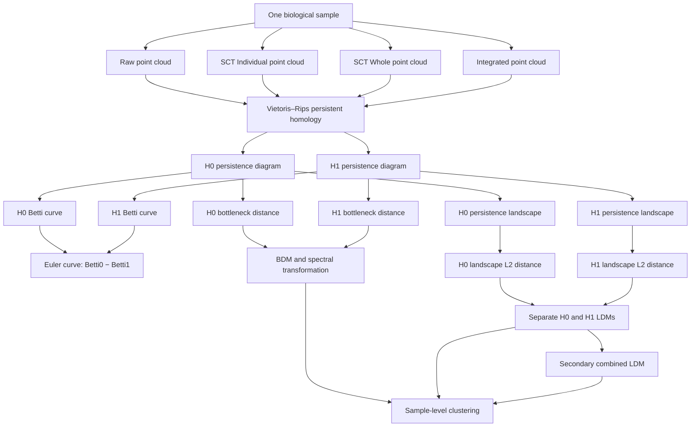

# Persistence Diagram and Landscape Map

## Document control

| Field | Value |
|---|---|
| Status | Conceptual draft; corrected landscape pipeline not yet activated |
| Created | 2026-08-05 |
| Intended uses | Repository documentation, methods development, and eventual manuscript figure source |
| Governing specification | `docs/specifications/PERSISTENCE_LANDSCAPE_SPECIFICATION_V1.md` |
| Required revision gate | Exact/error-controlled landscape engine plus observation-unit and filtration eligibility audits |

This Mermaid diagram is the editable source of truth for the project’s persistence-diagram and persistence-landscape workflow. It distinguishes preprocessing representations, homology dimensions, diagram-derived summaries, distance matrices, and downstream clustering. It describes the intended conceptual architecture; it does not assert that the corrected scientific pipeline has already been activated or rerun.

## Interpretation constraints

- Raw, SCT Individual, SCT Whole, and Integrated are separate comparison strata; their filtration scales are not pooled implicitly.
- H0 and H1 are homology dimensions. Landscape levels `lambda_1`, `lambda_2`, and so on exist separately within each dimension.
- The proposed corrected primary landscape calculation uses every active level with exact or error-controlled integration.
- `k=1` is retained only as a clearly labeled paper-compatibility sensitivity.
- H0 and H1 distances are primary separate outputs. Their unweighted combination is secondary and must report the H1 energy contribution.
- Betti, Euler, bottleneck, spectral, and landscape representations are related diagram-derived summaries; they are not interchangeable.
- Sample clustering is downstream of the distance definition. A change to levels, filtration evaluation, distance, or H0/H1 combination can change the clustering.

## Final-figure checklist

Before treating this as a manuscript figure:

1. Replace “intended conceptual architecture” with the approved implemented contract.
2. Add the exact/adaptive integration and numerical-error provenance node.
3. Confirm the eligible persistence-diagram input unit and filtration policy.
4. Decide whether BDM/SDM remain in the revised primary or sensitivity analyses.
5. Add versioned configuration identifiers to the rendered caption.
6. Render deterministic SVG and PNG outputs from this Mermaid source.
7. Review terminology, accessibility, colors, dimensions, and caption with the author team.
