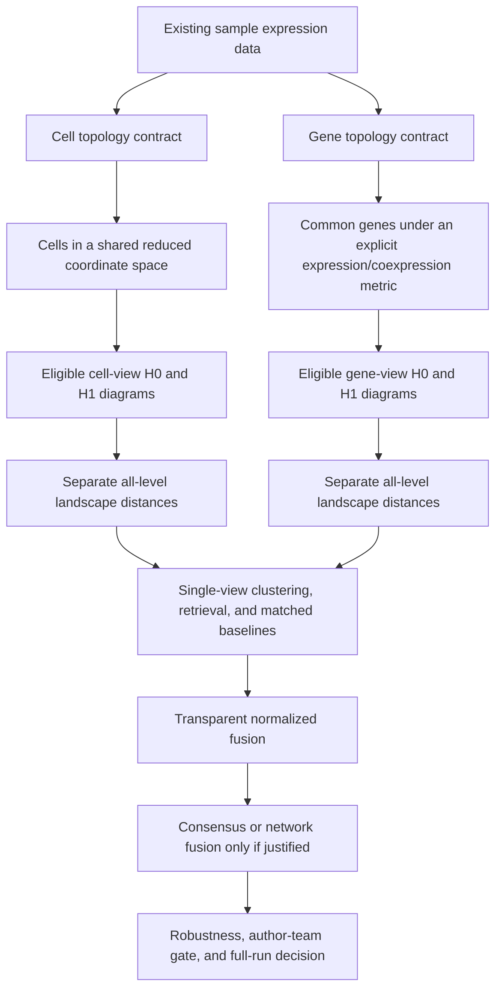

# Dual-view and multiview topology sprint roadmap

## Document control

| Field | Value |
|---|---|
| Status | MV-01 contract complete and technically frozen; MV-02 is next |
| Date | 2026-08-05 |
| Scope | Existing scPHcompare data; cell topology, gene topology, topological distances, clustering, and multiview fusion |
| Primary scientific view | Cell topology |
| Secondary scientific view | Gene topology |
| Fusion status | Exploratory until both component views pass their independent gates |
| Related phases | P1, P4, P5, P7, P8 |
| New-data policy | Existing data first; use the recorded Phase 4 evidence-gap trigger before adding data |

## 1. Research direction

The expanded project will study two distinct topological objects derived from each sample:

1. **Cell topology:** cells are points in a shared expression-derived coordinate system. This is the confirmatory correction because it matches the dissertation's stated cell-by-cell intent.
2. **Gene topology:** a common set of genes are points whose pairwise relationships are estimated across cells. This is a deliberately specified secondary view, not a retroactive validation of the accidental legacy orientation.

The central prospective question is:

> Do cell-population topology and gene-relationship topology contain complementary biological information, and how do preprocessing and integration redistribute biological and technical structure between those views?



The legacy feature-as-point route remains `legacy_gene_view_v0`, usable only for historical reproduction and stress testing. A scientifically interpretable gene view must be regenerated under a new contract.

## 2. Non-negotiable design rules

1. Keep three distance layers distinct:
   - within-sample geometry used to create a filtration;
   - between-sample persistence-summary distance;
   - sample clustering or retrieval method.
2. Report H0 and H1 separately before any combined or fused result.
3. Do not tune a distance, fusion weight, cluster count, or method using evaluation labels from the test data.
4. Use stable sample IDs and record matrix orientation, feature/cell identifiers, transformations, dimensions, metric, filtration, random seed, software versions, and input digests.
5. Fit shared transformations within the permitted analysis partition. Any blocked or held-out evaluation must fit PCA, scaling, feature selection, and learned fusion parameters without access to prohibited test information.
6. Match or repeatedly subsample cell counts so that sample size is not silently treated as topology.
7. Use exactly the same common gene universe within a gene-view comparison stratum; quantify missingness and feature-selection sensitivity.
8. A mathematical metric is preferred for Vietoris-Rips PH. Correlation sensitivity should use a metric construction such as `sqrt(2 * (1 - r))` on appropriately standardized vectors rather than assuming `1-r` is always metric.
9. Preserve H0/H1 failures and small-sample exclusions as structured outcomes; do not silently drop difficult samples.
10. Freeze a small confirmatory method set before inspecting full-dataset biological outcomes. Everything else is labeled sensitivity or exploratory.
11. Do not add external data until an existing-data evidence gap is recorded and approved.
12. No full biological rerun, manuscript claim, or production optimization is authorized merely by completing a pilot sprint.

## 3. Method hierarchy that prevents a method zoo

### Confirmatory core to be frozen before the full benchmark

| Layer | Cell view | Gene view | Fusion |
|---|---|---|---|
| Points | Cells | Common genes | Samples represented by component distance matrices |
| Within-sample geometry | Euclidean in a shared PCA space | One approved standardized expression/coexpression metric | Not applicable |
| Homology | H0 and H1 separately | H0 and H1 separately | Four components remain auditable |
| Between-sample distance | All-level exact/error-controlled landscape L2 | All-level exact/error-controlled landscape L2 | Equal-weight normalized distance fusion |
| Sample analysis | One frozen clustering method plus continuous retrieval | Same rules | Same rules |

MV-01 froze correlation-chord gene geometry, 30-PC Euclidean cell geometry, PAM, matched 384-cell subsamples, a common 500-gene panel, and complete Vietoris-Rips filtration. The exact contracts and sensitivities are recorded in `docs/specifications/DUAL_VIEW_TOPOLOGY_SPECIFICATION_V1.md` and must not be changed after viewing headline results without a new decision record.

### Prespecified sensitivities

- Cell geometry: cosine in the same shared reduced space; limited PCA-dimension sensitivity.
- Gene geometry: normalized RMS Euclidean and correlation-chord alternatives.
- Persistence comparison: bottleneck plus one aggregate matching distance, preferably Wasserstein or sliced Wasserstein after feasibility testing.
- Clustering: hierarchical, PAM/k-medoids, and spectral clustering under identical selection rules.
- Cluster number: explicitly labeled oracle `k` plus at least one non-oracle stability/selection rule.
- Evaluation without `k`: sample retrieval, nearest-neighbor classification under blocked validation, or another prespecified continuous distance task.

### Exploratory methods, admitted only after the core works

- Four-component learned weights for cell-H0, cell-H1, gene-H0, and gene-H1.
- Consensus clustering across views and repeated subsamples.
- Similarity Network Fusion.
- Multikernel or co-regularized spectral methods.
- Persistence images/kernels, alternative complexes, H2, or additional integration methods.

An exploratory method enters the confirmatory set only through a recorded decision made before the next confirmatory execution.

## 4. Sprint sequence and dependencies

| Sprint | Purpose | Depends on | Primary gate | Status |
|---|---|---|---|---|
| MV-01 | Freeze dual-view scientific and mathematical contracts | Current orientation/landscape audits | G-MV1: definitions approved | `complete` — technical pilot freeze; no scientific activation |
| MV-02 | Implement orientation-safe view constructors and fixtures | MV-01 | G-MV2: contracts enforced by tests | `ready` |
| MV-03 | Generate corrected pilot H0/H1 diagrams and establish feasibility | MV-02 | G-MV3: eligible diagrams exist | `not_started` |
| MV-04 | Validate topological distances and production calculation | MV-03 | G-MV4: sample-distance matrices are correct and feasible | `not_started` |
| MV-05 | Compare clustering and matched non-topological baselines | MV-04; statistical-plan draft | G-MV5: fair single-view benchmark | `not_started` |
| MV-06 | Test transparent multiview fusion and complementarity | MV-05 | G-MV6: fusion adds stable information or is rejected | `not_started` |
| MV-07 | Robustness synthesis and full-run decision | MV-06 | G-MV7: freeze, revise, or stop before full rerun | `not_started` |

MV-01 through MV-04 are the immediate implementation sequence. MV-05 through MV-07 deliberately require valid upstream artifacts and a statistical plan.

## 5. MV-01 — Dual-view scientific contract

### Objective

Define exactly what a point, coordinate, distance, filtration, persistence summary, and comparison stratum means in each view before changing production PH code.

### Tasks

| ID | Task | Required evidence/output |
|---|---|---|
| MV1-01 | Write the cell-view contract | Cell-by-coordinate orientation; shared-space fit/transform rules; coordinate names; scaling; eligible sample rules |
| MV1-02 | Write the gene-view contract | Common-gene rules; cell matching; normalization; distance formula; gene identifiers; interpretation boundary |
| MV1-03 | Specify filtration policy | Absolute versus normalized scale; threshold/censoring behavior; common-stratum requirements; infinite-interval handling |
| MV1-04 | Freeze initial H0/H1 hierarchy | H0 and H1 primary outputs; optional combined output; interpretation restrictions |
| MV1-05 | Freeze pilot method shortlist | One primary and limited sensitivity choice at every distance/clustering layer |
| MV1-06 | Define provenance schema | View ID, contract version, orientation, metric, fit partition, cells/genes, seed, software, hashes, exclusions |
| MV1-07 | Define pilot sample manifest | Deterministic existing-data subset spanning sample sizes, tissues/studies, and preprocessing representations without claiming representativeness |
| MV1-08 | Record estimands and failure hypotheses | What each view may reveal; confounding alternatives; results that would stop or narrow the project |

### Decisions that must be explicit

- Whether shared PCA is trained globally for descriptive analysis and within folds for blocked evaluation, or whether only the latter is allowed.
- The primary PCA dimension and limited sensitivity dimensions.
- Whether the primary gene metric is correlation-chord or standardized RMS Euclidean.
- The number of cells per repeated subsample and how samples below that count are handled.
- The common gene universe and whether genes are selected globally, within training partitions, or from a fixed external list.
- The primary filtration threshold rule for each view.
- Which clustering algorithm is confirmatory and which are sensitivities.

### Acceptance gate G-MV1 — passed for pilot implementation

- [x] Every matrix axis and identifier has an explicit meaning.
- [x] Both within-sample geometries are mathematically specified.
- [x] Cell-count and gene-universe controls are prespecified.
- [x] H0/H1 and filtration contracts are technically frozen.
- [x] The pilot method set is small enough to execute in stages.
- [x] No choice depends on corrected pilot biological performance.

Evidence: `docs/specifications/DUAL_VIEW_TOPOLOGY_SPECIFICATION_V1.md`, `docs/audits/MV01_DUAL_VIEW_CONTRACT_2026-08-05.md`, `docs/audits/mv01-method-freeze-2026-08-05.csv`, and `docs/audits/mv01-pilot-sample-manifest-2026-08-05.csv`. This gate pass permits MV-02/MV-03 technical work only; it does not approve a confirmatory full run.

### Stop condition

Do not implement production PH if either view lacks a comparable coordinate/metric contract or if its biological interpretation cannot be stated without ambiguity.

## 6. MV-02 — Orientation-safe constructors and analytical fixtures

### Objective

Make it difficult to confuse cells, genes, and coordinates again.

### Tasks

| ID | Task | Required evidence/output |
|---|---|---|
| MV2-01 | Implement typed cell-view constructor | Returns cells by named shared coordinates or an explicit `dist` object; rejects transposed/anonymous inputs |
| MV2-02 | Implement typed gene-view constructor | Returns common genes plus an explicit validated metric/distance object; records cell matching and normalization |
| MV2-03 | Introduce versioned view objects | Class/schema includes `view_id`, contract version, axis roles, IDs, metric, transformations, and digest |
| MV2-04 | Route PH through explicit point-cloud or `dist` contracts | No bare ambiguous expression matrix reaches `vietoris_rips()` |
| MV2-05 | Preserve legacy compatibility separately | Legacy route is visibly named, warned, and prohibited from corrected cache keys/results |
| MV2-06 | Add orientation and permutation fixtures | Tests distinguish cell and gene views; gene distance is invariant to cell-column permutation where mathematically expected |
| MV2-07 | Add metric/property tests | Symmetry, non-negativity, zero diagonal, finite values, triangle checks where applicable, and dimension/identifier failures |
| MV2-08 | Add provenance/cache tests | Axis or metric changes invalidate caches; stable repeats retain hashes |

### Required fixtures

- A small matrix where cell geometry and gene geometry have analytically different H0 structures.
- A matrix whose transpose has different dimensions but plausible numeric values, proving dimension-only checks are insufficient.
- Duplicated/constant genes and cells.
- Missing/reordered genes.
- Unequal cell counts and repeated deterministic subsampling.
- Correlation edge cases, including zero-variance genes.

### Acceptance gate G-MV2

- [ ] An ambiguous bare assay matrix cannot enter the corrected PH route.
- [ ] Transposition and identifier mistakes fail loudly.
- [ ] Analytical fixtures produce the intended, different cell/gene diagrams.
- [ ] Legacy and corrected artifacts cannot collide in caches.
- [ ] Complete package tests and source-package check pass.

## 7. MV-03 — Corrected pilot diagrams and feasibility boundary

### Objective

Generate the first scientifically eligible cell-view and deliberately specified gene-view H0/H1 diagrams using existing data, then measure whether the design is computationally feasible.

### Tasks

| ID | Task | Required evidence/output |
|---|---|---|
| MV3-01 | Freeze pilot manifest and seeds | Sample IDs, strata, cell counts, selected genes, representations, repetitions, exclusions |
| MV3-02 | Fit/transform the shared cell space | PCA/scaling provenance and leakage audit; coordinate comparability checks |
| MV3-03 | Generate repeated cell-view inputs | Matched cell/landmark subsamples and stability manifests |
| MV3-04 | Generate repeated gene-view inputs | Common genes, matched cells, chosen metric, zero-variance/missing-gene disposition |
| MV3-05 | Compute H0 and H1 diagrams | Separate view/representation/dimension artifacts with stable IDs and threshold provenance |
| MV3-06 | Profile PH scaling | Runtime, CPU, peak process-tree memory, failures, filtration depth, interval counts, and sample-size scaling |
| MV3-07 | Diagnose stability | Diagram and summary variation across cell subsamples, seeds, PCA dimensions, and gene metrics without outcome-label tuning |
| MV3-08 | Select feasible pilot contract | Keep, revise, approximate, or stop each view with reasons |

### Acceptance gate G-MV3

- [ ] At least one deterministic pilot stratum has eligible H0/H1 diagrams for both views.
- [ ] Every artifact is bound to the generating view contract and sample manifest.
- [ ] Cell/gene point counts agree with provenance.
- [ ] Filtration and infinite-feature handling are explicit.
- [ ] Runtime and memory boundaries are measured rather than guessed.
- [ ] Repeated subsampling stability is sufficient for the intended comparison or the instability is documented as a stop/narrowing result.

### Stop conditions

- Stop or redesign a view if results are dominated by point count, library size, zero-variance features, or unstable subsampling.
- Do not hide `ripserr` failures by increasing minimum-cell thresholds after viewing biological outcomes.
- Do not proceed to full pairwise distances if eligible diagrams cannot be generated reproducibly.

## 8. MV-04 — Topological distance and production-engine validation

### Objective

Turn eligible pilot diagrams into correct, auditable sample-distance matrices and choose a feasible production calculation.

### Tasks

| ID | Task | Required evidence/output |
|---|---|---|
| MV4-01 | Batch the corrected landscape prototype | Persistent/batched interface; no per-pair interpreter startup; frozen oracle agreement |
| MV4-02 | Validate all-level H0/H1 L2 matrices | Symmetry, diagonal, identifiers, exact/reference agreement, error policy, determinism |
| MV4-03 | Add limited diagram-distance sensitivities | Bottleneck and one Wasserstein-family method with fixtures and resource evidence |
| MV4-04 | Define distance normalization | Training-safe scale normalization for cross-view fusion; zero/degenerate-matrix handling |
| MV4-05 | Quantify H0/H1 contributions | Pairwise contribution distributions without allowing a dominant component to be called balanced |
| MV4-06 | Profile pairwise scaling | Time/RSS/I/O/worker startup across view, dimension, interval count, and sample count |
| MV4-07 | Re-evaluate Rust gate | Only after mature-library batching is measured on eligible diagrams |
| MV4-08 | Freeze immutable pilot distance bundle | Matrices, manifests, failures, software, hashes, and contract IDs |

### Acceptance gate G-MV4

- [ ] All primary matrices pass mathematical and identifier checks.
- [ ] Landscape results agree with the R correctness oracle on tractable eligible cases.
- [ ] H0 and H1 are retained separately.
- [ ] Sensitivity methods are complete or technically excluded with evidence.
- [ ] The production path has measured runtime and peak memory.
- [ ] Rust remains rejected unless every existing gate criterion is satisfied.

## 9. MV-05 — Single-view clustering and matched baseline benchmark

### Objective

Determine what each topological view contributes before attempting fusion.

### Tasks

| ID | Task | Required evidence/output |
|---|---|---|
| MV5-01 | Freeze evaluation endpoints | Biological conservation, study/technology signal, integration distortion, retrieval, and clustering estimands |
| MV5-02 | Build matched non-topological views | Pseudobulk, shared-space centroids, composition, distributional/OT, or other approved sample-level baselines |
| MV5-03 | Apply common clustering panel | Hierarchical, PAM, and spectral under the same tuning and failure rules where valid |
| MV5-04 | Separate oracle and non-oracle `k` | Known-label `k` benchmark versus prespecified selection/stability rule |
| MV5-05 | Run continuous tasks | Retrieval/classification or distance-based evaluation that does not depend on a chosen cluster count |
| MV5-06 | Use blocked validation | Study-blocked or leave-one-study-out design with transformation/tuning leakage checks |
| MV5-07 | Estimate uncertainty | Paired differences, repeated subsampling uncertainty, multiplicity families, and null-result retention |
| MV5-08 | Write single-view disposition | Cell works/fails/uncertain; gene works/fails/uncertain; H0/H1 contribution and confounding boundaries |

### Acceptance gate G-MV5

- [ ] Both views use the same samples, splits, endpoints, and eligible clustering rules.
- [ ] Baselines operate at the same sample-level unit.
- [ ] No method is tuned preferentially using outcome labels.
- [ ] Biological and technical endpoints are reported separately.
- [ ] Nulls, failures, and negative comparisons are retained.
- [ ] Each view has an independent scientific interpretation before fusion.

## 10. MV-06 — Multiview fusion and complementarity

### Objective

Test whether cell and gene topology add complementary information rather than merely averaging redundant or confounded distances.

### Fusion sequence

1. Normalize component distance matrices using the frozen, training-safe rule.
2. Compare cell-only and gene-only results.
3. Test equal-weight cell/gene fusion.
4. Decompose the four components: cell-H0, cell-H1, gene-H0, gene-H1.
5. Run a prespecified weight sensitivity grid such as `0, 0.25, 0.5, 0.75, 1` without selecting the best test-label result.
6. Test consensus clustering if independent clusterings are stable.
7. Admit Similarity Network Fusion or multikernel learning only if simple fusion demonstrates genuine complementarity and tuning can be nested correctly.

### Tasks

| ID | Task | Required evidence/output |
|---|---|---|
| MV6-01 | Implement normalized equal-weight fusion | Exact formula, scale provenance, component IDs, unit tests |
| MV6-02 | Implement four-component audit | Contribution of every view/dimension for every pair and result |
| MV6-03 | Test prespecified weight sensitivity | Complete grid with no winner-only reporting |
| MV6-04 | Quantify complementarity | Distance correlation, neighborhood overlap, discordant pairs, unique versus shared endpoint association |
| MV6-05 | Run blocked fusion evaluation | Fusion versus both components and matched baselines with paired uncertainty |
| MV6-06 | Evaluate consensus/network fusion gate | Complexity admitted only when simpler fusion evidence warrants it |
| MV6-07 | Write fusion disposition | Adds stable value, redundant, technically confounded, unstable, or rejected |

### Acceptance gate G-MV6

- [ ] Fusion is compared against both component views, not only conventional baselines.
- [ ] Component scale and H0/H1 dominance are reported.
- [ ] Any learned weight or kernel is trained without test-label leakage.
- [ ] Improvement is stable across blocked splits and subsamples, not driven by one study or tissue.
- [ ] Added complexity is rejected when equal-weight or consensus fusion is sufficient.

### Stop condition

If fusion does not reliably outperform the stronger component view, report the views separately. A negative fusion result does not invalidate either single-view analysis.

## 11. MV-07 — Robustness synthesis and full-run decision

### Objective

Decide whether the dual-view framework is ready for a full existing-data run, requires revision, or should be narrowed before more computation.

### Tasks

| ID | Task | Required evidence/output |
|---|---|---|
| MV7-01 | Run prespecified robustness matrix | Cell counts, gene counts, PCA dimensions, seeds, metrics, thresholds, H0/H1, outliers, and composition controls |
| MV7-02 | Audit confounding | Tissue, study, technology, sample size, library size, and preprocessing associations |
| MV7-03 | Run ablations | Remove one view, dimension, metric, or integration step at a time |
| MV7-04 | Reconcile computational budget | Full-run time, memory, storage, worker, caching, and failure estimates |
| MV7-05 | Evaluate existing-data sufficiency | Trigger external-data review only for a named unresolved estimand |
| MV7-06 | Freeze confirmatory specification | Exact methods, parameters, endpoints, exclusions, seeds, multiplicity, and artifact schema |
| MV7-07 | Draft claim boundaries | Supported hypotheses, narrowed claims, exploratory findings, failures, and prohibited causal language |
| MV7-08 | Author-team gate | Review with project owner, Dr. Rouchka, and Dr. Mistry before full confirmatory execution/manuscript claims |

### Acceptance gate G-MV7

- [ ] The confirmatory configuration was chosen without outcome-driven tuning.
- [ ] Robustness and confounding results support the intended claims.
- [ ] Full-run cost and failure policy are approved.
- [ ] Existing data are sufficient, or the new-data trigger is documented.
- [ ] Cell, gene, and fusion claims have separate evidence boundaries.
- [ ] Author-team decision is recorded.

## 12. Required artifact layout

Corrected outputs should be isolated from legacy artifacts:

```text
results/
  contracts/
    cell_topology_v1/
    gene_topology_v1/
  diagrams/
    <view>/<stratum>/<sample>/<subsample>/<H0-or-H1>/
  distances/
    <view>/<summary>/<dimension>/<stratum>/
  clustering/
    <view-or-fusion>/<distance>/<algorithm>/<selection-rule>/
  fusion/
    <fusion-contract>/<components>/<weights-or-method>/
  manifests/
  failures/
```

Every artifact must be recoverable from a manifest; directory names are organizational aids, not the sole provenance mechanism.

## 13. Decision table after each sprint

Each sprint report must end with:

| Question | Allowed disposition |
|---|---|
| Scientific contract coherent? | approve / revise / reject view |
| Correctness demonstrated? | pass / fail / insufficient evidence |
| Computation feasible? | yes / bounded approximation required / no |
| Biological interpretation permitted? | confirmatory / secondary / exploratory / prohibited |
| Next action | advance / repeat named task / narrow scope / stop |

## 14. Immediate next action

Execute MV-02: implement versioned orientation-safe view objects, cell/gene constructors, explicit point-cloud or `dist` routing, analytical fixtures, metric/property validation, provenance/cache identities, and a visibly separate legacy compatibility boundary. Do not generate the existing-data pilot diagrams until G-MV2 passes.
