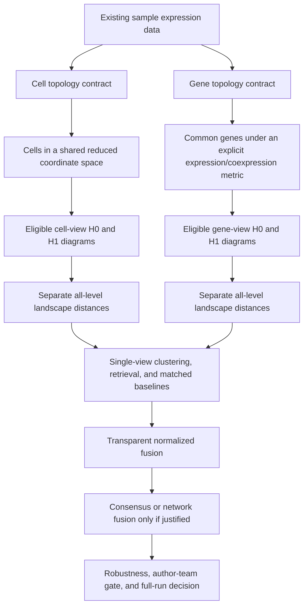

# Dual-view and multiview topology sprint roadmap

## Document control

| Field | Value |
|---|---|
| Status | MV5-D1 complete: 75 independently validated label-closed SCT cell-fold caches and 6,750 typed coordinate views; production PH and G-MV5 remain open |
| Date | 2026-08-05 |
| Scope | Existing scPHcompare data; cell topology, gene topology, topological distances, clustering, and multiview fusion |
| Primary scientific view | Cell topology |
| Secondary scientific view | Gene topology |
| Fusion status | Exploratory until both component views pass their independent gates |
| Related phases | P1, P4, P5, P7, P8 |
| New-data policy | Existing data first; use the recorded Phase 4 evidence-gap trigger before adding data |

## 1. Research direction

The expanded project will study two distinct topological objects derived from each sample:

1. **Cell topology:** cells are points in a shared expression-derived coordinate system. This is the confirmatory correction because it matches the dissertation's stated cell-by-cell intent.
2. **Gene topology:** a common set of genes are points whose pairwise relationships are estimated across cells. This is a deliberately specified secondary view, not a retroactive validation of the accidental legacy orientation.

The central prospective question is:

> Do cell-population topology and gene-relationship topology contain complementary biological information, and how do preprocessing and integration redistribute biological and technical structure between those views?



The legacy feature-as-point route remains `legacy_gene_view_v0`, usable only for historical reproduction and stress testing. A scientifically interpretable gene view must be regenerated under a new contract.

## 2. Non-negotiable design rules

1. Keep three distance layers distinct:
   - within-sample geometry used to create a filtration;
   - between-sample persistence-summary distance;
   - sample clustering or retrieval method.
2. Report H0 and H1 separately before any combined or fused result.
3. Do not tune a distance, fusion weight, cluster count, or method using evaluation labels from the test data.
4. Use stable sample IDs and record matrix orientation, feature/cell identifiers, transformations, dimensions, metric, filtration, random seed, software versions, and input digests.
5. Fit shared transformations within the permitted analysis partition. Any blocked or held-out evaluation must fit PCA, scaling, feature selection, and learned fusion parameters without access to prohibited test information.
6. Match or repeatedly subsample cell counts so that sample size is not silently treated as topology.
7. Use exactly the same common gene universe within a gene-view comparison stratum; quantify missingness and feature-selection sensitivity.
8. A mathematical metric is preferred for Vietoris-Rips PH. Correlation sensitivity should use a metric construction such as `sqrt(2 * (1 - r))` on appropriately standardized vectors rather than assuming `1-r` is always metric.
9. Preserve H0/H1 failures and small-sample exclusions as structured outcomes; do not silently drop difficult samples.
10. Freeze a small confirmatory method set before inspecting full-dataset biological outcomes. Everything else is labeled sensitivity or exploratory.
11. Do not add external data until an existing-data evidence gap is recorded and approved.
12. No full biological rerun, manuscript claim, or production optimization is authorized merely by completing a pilot sprint.

## 3. Method hierarchy that prevents a method zoo

### Confirmatory core to be frozen before the full benchmark

| Layer | Cell view | Gene view | Fusion |
|---|---|---|---|
| Points | Cells | Common genes | Samples represented by component distance matrices |
| Within-sample geometry | Euclidean in a shared PCA space | One approved standardized expression/coexpression metric | Not applicable |
| Homology | H0 and H1 separately | H0 and H1 separately | Four components remain auditable |
| Between-sample distance | All-level exact/error-controlled landscape L2 | All-level exact/error-controlled landscape L2 | Equal-weight normalized distance fusion |
| Sample analysis | One frozen clustering method plus continuous retrieval | Same rules | Same rules |

MV-01 froze correlation-chord gene geometry, 30-PC Euclidean cell geometry, PAM, matched 384-cell subsamples, a common 500-gene panel, and complete Vietoris-Rips filtration. The exact contracts and sensitivities are recorded in `docs/specifications/DUAL_VIEW_TOPOLOGY_SPECIFICATION_V1.md` and must not be changed after viewing headline results without a new decision record.

### Prespecified sensitivities

- Cell geometry: cosine in the same shared reduced space; limited PCA-dimension sensitivity.
- Gene geometry: normalized RMS Euclidean and correlation-chord alternatives.
- Persistence comparison: bottleneck plus one aggregate matching distance, preferably Wasserstein or sliced Wasserstein after feasibility testing.
- Clustering: hierarchical, PAM/k-medoids, and spectral clustering under identical selection rules.
- Cluster number: explicitly labeled oracle `k` plus at least one non-oracle stability/selection rule.
- Evaluation without `k`: sample retrieval, nearest-neighbor classification under blocked validation, or another prespecified continuous distance task.

### Exploratory methods, admitted only after the core works

- Four-component learned weights for cell-H0, cell-H1, gene-H0, and gene-H1.
- Consensus clustering across views and repeated subsamples.
- Similarity Network Fusion.
- Multikernel or co-regularized spectral methods.
- Persistence images/kernels, alternative complexes, H2, or additional integration methods.

An exploratory method enters the confirmatory set only through a recorded decision made before the next confirmatory execution.

## 4. Sprint sequence and dependencies

| Sprint | Purpose | Depends on | Primary gate | Status |
|---|---|---|---|---|
| MV-01 | Freeze dual-view scientific and mathematical contracts | Current orientation/landscape audits | G-MV1: definitions approved | `complete` — technical pilot freeze; no scientific activation |
| MV-02 | Implement orientation-safe view constructors and fixtures | MV-01 | G-MV2: contracts enforced by tests | `complete` — technical gate; no biological activation |
| MV-03 | Generate corrected pilot H0/H1 diagrams and establish feasibility | MV-02 | G-MV3: eligible diagrams exist | `complete` — 132 eligible jobs; technical gate only |
| MV-04 | Validate topological distances and production calculation | MV-03 | G-MV4: sample-distance matrices are correct and feasible | `complete` — immutable primary matrices; bounded sensitivity exclusions |
| MV-05 | Compare clustering and matched non-topological baselines | MV-04; frozen statistical plan | G-MV5: fair single-view benchmark | `completed` — MV5-S executes and independently validates the complete prediction-locked clustering outcome contract without method selection |
| MV-06 | Test transparent multiview fusion and complementarity | MV-05 | G-MV6: fusion adds stable information or is rejected | `complete_negative` — exact-commit blocked evaluation rejects equal-weight fusion under the required both-component MRR rule; advanced fusion is closed |
| MV-07 | Robustness synthesis and full-run decision | MV-06 | G-MV7: freeze, revise, or stop before full rerun | `owner_author_team_decision_required` — MV7-C recommends methods-focused drafting before more PH; external validation is conditional on claim ambition |

MV-01 through MV-04 are the immediate implementation sequence. MV-05 through MV-07 deliberately require valid upstream artifacts and a statistical plan.

## 5. MV-01 — Dual-view scientific contract

### Objective

Define exactly what a point, coordinate, distance, filtration, persistence summary, and comparison stratum means in each view before changing production PH code.

### Tasks

| ID | Task | Required evidence/output |
|---|---|---|
| MV1-01 | Write the cell-view contract | Cell-by-coordinate orientation; shared-space fit/transform rules; coordinate names; scaling; eligible sample rules |
| MV1-02 | Write the gene-view contract | Common-gene rules; cell matching; normalization; distance formula; gene identifiers; interpretation boundary |
| MV1-03 | Specify filtration policy | Absolute versus normalized scale; threshold/censoring behavior; common-stratum requirements; infinite-interval handling |
| MV1-04 | Freeze initial H0/H1 hierarchy | H0 and H1 primary outputs; optional combined output; interpretation restrictions |
| MV1-05 | Freeze pilot method shortlist | One primary and limited sensitivity choice at every distance/clustering layer |
| MV1-06 | Define provenance schema | View ID, contract version, orientation, metric, fit partition, cells/genes, seed, software, hashes, exclusions |
| MV1-07 | Define pilot sample manifest | Deterministic existing-data subset spanning sample sizes, tissues/studies, and preprocessing representations without claiming representativeness |
| MV1-08 | Record estimands and failure hypotheses | What each view may reveal; confounding alternatives; results that would stop or narrow the project |

### Decisions that must be explicit

- Whether shared PCA is trained globally for descriptive analysis and within folds for blocked evaluation, or whether only the latter is allowed.
- The primary PCA dimension and limited sensitivity dimensions.
- Whether the primary gene metric is correlation-chord or standardized RMS Euclidean.
- The number of cells per repeated subsample and how samples below that count are handled.
- The common gene universe and whether genes are selected globally, within training partitions, or from a fixed external list.
- The primary filtration threshold rule for each view.
- Which clustering algorithm is confirmatory and which are sensitivities.

### Acceptance gate G-MV1 — passed for pilot implementation

- [x] Every matrix axis and identifier has an explicit meaning.
- [x] Both within-sample geometries are mathematically specified.
- [x] Cell-count and gene-universe controls are prespecified.
- [x] H0/H1 and filtration contracts are technically frozen.
- [x] The pilot method set is small enough to execute in stages.
- [x] No choice depends on corrected pilot biological performance.

Evidence: `docs/specifications/DUAL_VIEW_TOPOLOGY_SPECIFICATION_V1.md`, `docs/audits/MV01_DUAL_VIEW_CONTRACT_2026-08-05.md`, `docs/audits/mv01-method-freeze-2026-08-05.csv`, and `docs/audits/mv01-pilot-sample-manifest-2026-08-05.csv`. This gate pass permits MV-02/MV-03 technical work only; it does not approve a confirmatory full run.

### Stop condition

Do not implement production PH if either view lacks a comparable coordinate/metric contract or if its biological interpretation cannot be stated without ambiguity.

## 6. MV-02 — Orientation-safe constructors and analytical fixtures

### Objective

Make it difficult to confuse cells, genes, and coordinates again.

### Tasks

| ID | Task | Required evidence/output |
|---|---|---|
| MV2-01 | Implement typed cell-view constructor | Returns cells by named shared coordinates or an explicit `dist` object; rejects transposed/anonymous inputs |
| MV2-02 | Implement typed gene-view constructor | Returns common genes plus an explicit validated metric/distance object; records cell matching and normalization |
| MV2-03 | Introduce versioned view objects | Class/schema includes `view_id`, contract version, axis roles, IDs, metric, transformations, and digest |
| MV2-04 | Route PH through explicit point-cloud or `dist` contracts | No bare ambiguous expression matrix reaches `vietoris_rips()` |
| MV2-05 | Preserve legacy compatibility separately | Legacy route is visibly named, warned, and prohibited from corrected cache keys/results |
| MV2-06 | Add orientation and permutation fixtures | Tests distinguish cell and gene views; gene distance is invariant to cell-column permutation where mathematically expected |
| MV2-07 | Add metric/property tests | Symmetry, non-negativity, zero diagonal, finite values, triangle checks where applicable, and dimension/identifier failures |
| MV2-08 | Add provenance/cache tests | Axis or metric changes invalidate caches; stable repeats retain hashes |

### Required fixtures

- A small matrix where cell geometry and gene geometry have analytically different H0 structures.
- A matrix whose transpose has different dimensions but plausible numeric values, proving dimension-only checks are insufficient.
- Duplicated/constant genes and cells.
- Missing/reordered genes.
- Unequal cell counts and repeated deterministic subsampling.
- Correlation edge cases, including zero-variance genes.

### Acceptance gate G-MV2

- [x] An ambiguous bare assay matrix cannot enter the corrected PH route.
- [x] Transposition and identifier mistakes fail loudly.
- [x] Analytical fixtures produce the intended, different cell/gene diagrams.
- [x] Legacy and corrected artifacts cannot collide in caches.
- [x] Complete package tests and source-package check pass.

Evidence: `R/dual_view_topology.R`, `tests/testthat/test-dual-view-topology.R`, generated API documentation, and `docs/audits/MV02_ORIENTATION_SAFE_CONSTRUCTORS_2026-08-05.md`. G-MV2 passes for technical implementation only. The reduced analytical profile is permanently ineligible for scientific results, and the existing-data pilot remains prohibited until MV-03 preflight and resource controls are implemented.

## 7. MV-03 — Corrected pilot diagrams and feasibility boundary

### Objective

Generate the first scientifically eligible cell-view and deliberately specified gene-view H0/H1 diagrams using existing data, then measure whether the design is computationally feasible.

### Tasks

| ID | Task | Required evidence/output |
|---|---|---|
| MV3-01 | Freeze pilot manifest and seeds | Sample IDs, strata, cell counts, selected genes, representations, repetitions, exclusions |
| MV3-02 | Fit/transform the shared cell space | PCA/scaling provenance and leakage audit; coordinate comparability checks |
| MV3-03 | Generate repeated cell-view inputs | Matched cell/landmark subsamples and stability manifests |
| MV3-04 | Generate repeated gene-view inputs | Common genes, matched cells, chosen metric, zero-variance/missing-gene disposition |
| MV3-05 | Compute H0 and H1 diagrams | Separate view/representation/dimension artifacts with stable IDs and threshold provenance |
| MV3-06 | Profile PH scaling | Runtime, CPU, peak process-tree memory, failures, filtration depth, interval counts, and sample-size scaling |
| MV3-07 | Diagnose stability | Diagram and summary variation across cell subsamples, seeds, PCA dimensions, and gene metrics without outcome-label tuning |
| MV3-08 | Select feasible pilot contract | Keep, revise, approximate, or stop each view with reasons |

### Acceptance gate G-MV3

- [x] At least one deterministic pilot stratum has eligible H0/H1 diagrams for both views.
- [x] Every artifact is bound to the generating view contract and sample manifest.
- [x] Cell/gene point counts agree with provenance.
- [x] Filtration and infinite-feature handling are explicit.
- [x] Runtime and memory boundaries are measured rather than guessed.
- [x] Repeated subsampling stability is sufficient for the intended comparison or the instability is documented as a stop/narrowing result.

**Gate disposition (2026-08-05): complete for technical advancement.** All 132
frozen Stage A/B/C jobs completed with eligible typed provenance and no
failures. The slowest job took 14.64 seconds and peak measured process-tree RSS
was about 1.04 GiB. Five-seed total-persistence CV had median 0.023 and maximum
0.120. This permits MV-04 distance validation only; biological interpretation
remains prohibited. Evidence:
`docs/audits/MV03_CORRECTED_PILOT_FEASIBILITY_2026-08-05.md`.

### Stop conditions

- Stop or redesign a view if results are dominated by point count, library size, zero-variance features, or unstable subsampling.
- Do not hide `ripserr` failures by increasing minimum-cell thresholds after viewing biological outcomes.
- Do not proceed to full pairwise distances if eligible diagrams cannot be generated reproducibly.

## 8. MV-04 — Topological distance and production-engine validation

### Objective

Turn eligible pilot diagrams into correct, auditable sample-distance matrices and choose a feasible production calculation.

### Tasks

| ID | Task | Required evidence/output |
|---|---|---|
| MV4-01 | Batch the corrected landscape prototype | Persistent/batched interface; no per-pair interpreter startup; frozen oracle agreement |
| MV4-02 | Validate all-level H0/H1 L2 matrices | Symmetry, diagonal, identifiers, exact/reference agreement, error policy, determinism |
| MV4-03 | Add limited diagram-distance sensitivities | Bottleneck and one Wasserstein-family method with fixtures and resource evidence |
| MV4-04 | Define distance normalization | Training-safe scale normalization for cross-view fusion; zero/degenerate-matrix handling |
| MV4-05 | Quantify H0/H1 contributions | Pairwise contribution distributions without allowing a dominant component to be called balanced |
| MV4-06 | Profile pairwise scaling | Time/RSS/I/O/worker startup across view, dimension, interval count, and sample count |
| MV4-07 | Re-evaluate Rust gate | Only after mature-library batching is measured on eligible diagrams |
| MV4-08 | Freeze immutable pilot distance bundle | Matrices, manifests, failures, software, hashes, and contract IDs |

### Acceptance gate G-MV4

- [x] All primary matrices pass mathematical and identifier checks.
- [x] Landscape results agree with the R correctness oracle on tractable eligible cases.
- [x] H0 and H1 are retained separately.
- [x] Sensitivity methods are complete or technically excluded with evidence.
- [x] The production path has measured runtime and peak memory.
- [x] Rust remains rejected because every existing gate criterion is not satisfied.

## 9. MV-05 — Single-view clustering and matched baseline benchmark

### Objective

Determine what each topological view contributes before attempting fusion.

### Tasks

| ID | Task | Required evidence/output |
|---|---|---|
| MV5-01 | Freeze evaluation endpoints | Biological conservation, study/technology signal, integration distortion, retrieval, and clustering estimands |
| MV5-02 | Build matched non-topological views | Pseudobulk, shared-space centroids, composition, distributional/OT, or other approved sample-level baselines |
| MV5-03 | Apply common clustering panel | Hierarchical, PAM, and spectral under the same tuning and failure rules where valid |
| MV5-04 | Separate oracle and non-oracle `k` | Known-label `k` benchmark versus prespecified selection/stability rule |
| MV5-05 | Run continuous tasks | Retrieval/classification or distance-based evaluation that does not depend on a chosen cluster count |
| MV5-06 | Use blocked validation | Study-blocked or leave-one-study-out design with transformation/tuning leakage checks |
| MV5-07 | Estimate uncertainty | Paired differences, repeated subsampling uncertainty, multiplicity families, and null-result retention |
| MV5-08 | Write single-view disposition | Cell works/fails/uncertain; gene works/fails/uncertain; H0/H1 contribution and confounding boundaries |

### Acceptance gate G-MV5

The plan-freeze readiness subgate passed on 2026-08-06: endpoints, units,
baselines, LOSO splits, label boundaries, clustering rules, uncertainty,
multiplicity, failures, and resource stages are frozen in
`docs/specifications/MV05_STATISTICAL_BENCHMARK_PLAN_V1.md`. This does not check
any G-MV5 item below; those require executed single-view results.

The MV5-A/MV5-B technical subgate also passed on 2026-08-06. All 18
label-closed LOSO manifests are immutable; analytical and 500-gene/384-cell
scientific-shape fixtures pass for the three matched baselines; and two
synthetic Seurat reference-mapping repetitions produced identical query
embeddings. This advances only to MV5-C and does not check the G-MV5 items.

MV5-C one-tissue feasibility completed on 2026-08-06 with outcomes still
closed. All ten fold/seed jobs completed cell topology for SCT and inductive
integration. SCT gene topology completed in the five 5-reference/1-query jobs
and was structurally unavailable in the five 1-reference/5-query jobs because
the training-only panel contained held-out constant genes. Exact all-level
H0/H1 distances, matched baselines, 85 matrices, neighbor rankings, and
label-free clustering artifacts are immutable. The naïve 90-sample projection
fails current per-job and aggregate caps, so MV5-D execution is not authorized.
This advances technical feasibility evidence but does not check a G-MV5 item.

MV5-C2 resource-safe engineering completed on 2026-08-06 with outcomes still
closed. Sample–seed SCT cache records, cached-fold execution, exact
query-to-training pair chunks, and immutable resume all reproduce MV5-C
exactly. The 90-sample plan reduces normalization operations 15-fold and
landscape rows 8.497-fold. Full all-view MV5-D remains prohibited at a 25.82 h
lower bound before integrated mapping; SCT cell-primary label-closed
precomputation is conditionally feasible at 18.68 h. This does not check a
G-MV5 item or authorize labels.

MV5-D0 normalization-cache gating ran on 2026-08-07 with outcomes still
closed. The 450-cache build stopped upstream because the monolithic raw RDS
expanded to about 45.74 GiB RSS, violating the 8-GiB guard. Six recovered
sample shards completed matrix-only SCT caches in 175.43 worker-seconds at
3.361 GiB maximum RSS and project to 3.009 GiB for 450 entries. Current-runtime
rebuilds are byte-reproducible, but legacy caches differ slightly despite
identical inputs, exposing an incomplete v1 runtime identity. Runtime-complete
v2 identities are now required. No fold, PH, landscape, clustering, endpoint,
or G-MV5 item advanced.

MV5-D0 stage 1 then completed on 2026-08-07 after exactly one existing
per-sample Seurat source was found for each frozen candidate. Ninety canonical
raw shards, 450 deterministic selection identities, and 450 runtime-complete
matrix-only SCT caches independently validate with zero failures. The cache
used 2.562 worker-hours, 1.81 GiB peak RSS, and 2.992 GB storage. The updated
SCT cell-primary lower bound is 10.525 hours. Execution stopped before folds,
PH, landscapes, distances, clustering, integration, or outcomes, so G-MV5
remains open.

MV5-D1 completed on 2026-08-07 with outcomes still closed. Feature selection,
standardization, and PCA are strictly training-derived in each LOSO fold.
Held-out absent selected features are mapped to the training mean (zero after
z-scoring), which is constant across cells and cannot alter within-sample
pairwise distances. Seventy-five fold-seed caches and 6,750 typed cell views
independently validate with zero failures at 2.376 worker-hours, 1.95 GiB peak
RSS, and 0.895 GB storage. The 8.510-hour SCT cell-primary value is only a
known-components lower bound because production cell PH remains unmeasured.
No PH, landscape, distance, clustering, integration, gene-view, or outcome job
ran, so G-MV5 remains open.

MV5-D2 bounded cell-PH profiling completed on 2026-08-07 with outcomes still
closed. Thirty deterministic views cover all 15 folds, all five seeds,
held-out/training roles, all nine folds with training-schema mapping, and six
unmapped held-out controls. All full-view H0 diagrams equal their Euclidean MST
oracles, five reruns are byte-identical, and ten reduced Ripserr/GUDHI H0/H1
checks agree after explicit essential-H0 normalization. Full PH projects to
6.752/7.135/10.187 worker-hours under median/P90/maximum assumptions; combined
cell-primary totals are 15.262/15.645/18.697 hours, below the 21.6-hour planning
cap. Full PH, landscapes, outcomes, and G-MV5 remain closed.

MV5-D3 full cell-PH production completed on 2026-08-07 with outcomes still
closed. All 75 fold-seed groups and 6,750 typed H0/H1 records independently
validate; all 6,750 stored full-view MST checks and 75 fresh MST recomputations
pass with zero recorded error. A separately executed 90-view group is object-
and byte-identical, and immutable resume preserved the original records and
checkpoint. Measured PH used 1.047 worker-hours, 273.1 MiB peak RSS, and
196.3 MB storage. With the existing 3.572-hour landscape projection, the
cell-primary total is 9.556 hours, leaving 12.044 hours below the planning cap.
Landscapes, outcomes, and G-MV5 remain closed.

MV5-D4 exact cell landscape distances completed on 2026-08-07 with outcomes
still closed. The frozen query-to-training scope contains 35,350 biological
pairs and 70,700 separate H0/H1 rows in 360 chunks. All 6,750 essential H0
classes were excluded; every active level entered exact critical-pair segment
integration. All rows, chunks, and groups independently validate, four complete
eligible R-oracle checks pass within `1.42e-14`, and a fresh 850-row group has
four byte-identical scientific files. A timing-embedded complete pass was
rejected and replaced by timing-separated v3 with identical scientific fields
for all 70,700 requests. Measured cell-primary precomputation is 7.150 hours,
14.450 hours below the planning cap. Outcomes and G-MV5 remain closed.

MV5-D5 label-closed cell retrieval-input assembly completed on 2026-08-08.
The 75 immutable fold-seed bundles contain separate H0 and H1 rankings, a raw
H0/H1 composite retained only as descriptive secondary output, the matched
same-cell energy baseline, and the same-panel training-standardized pseudobulk
context baseline. All 35,350 biological pairs and 176,750 method rows
independently validate; 375/375 method groups complete with zero failures.
Independent topology reproduction and 450 baseline oracle checks pass within
`1.14e-13`; admission, resume, and public assembly are byte-stable. Because
MV5-D4 contains no within-training topology pairs, no held-out-contaminated
component scale was fitted and no 262,675-pair topology expansion was launched.
Predictions are now immutable, but outcomes and G-MV5 remain closed.

MV5-G full label-closed integrated-coordinate production completed on
2026-08-09. All 75 fold-seed groups, 6,750 ordered coordinate views, and 450
held-out mappings independently validate. One complete group repeated byte
identically and the completed queue resumed with zero rebuilds. Measured
coordinate production used 9.107 worker-hours, 3.077 GiB peak RSS, and 806.4 MB;
the reserved total through integrated retrieval is 12.379 worker-hours and
1.335 GB. A separate integrated cell-PH sprint is authorized, but no integrated
PH, landscape, distance, outcome, clustering, gene-view, or fusion work ran, so
G-MV5 remains open.

MV5-H integrated cell-PH production completed on 2026-08-09. All 75 groups and
6,750 typed cells-as-observations views produced complete Euclidean VR H0/H1:
2,592,000 H0 and 1,545,943 H1 intervals. Every record passed independent
coordinate/record/file/diagram/stored-MST validation and 75 fresh full-view MST
checks. A separate 90-view group repeated byte identically and resume rebuilt
zero groups. PH measured 1.098 worker-hours, 274.9 MiB peak RSS, and 179.9 MB;
the reserved total through retrieval is 12.169 worker-hours and 1.269 GB. Exact
integrated landscape distances are separately authorized, but no landscape,
distance, outcome, clustering, gene-view, or fusion work ran, so G-MV5 remains
open.

MV5-I integrated cell landscape-distance production completed on 2026-08-09.
All 35,350 frozen held-out-query-to-training biological pairs produced separate
H0/H1 rows: 70,700 exact all-active-level distances in 360 immutable chunks.
Every request/result/source/level identity passed; four independent exact R
oracles agreed within 7.11e-14; all 14 maximum-group files repeated byte
identically; and all 720 production files survived a zero-rebuild resume.
Landscape work measured 0.576 worker-hours, 243.9 MiB peak RSS, and 1.255 GB
including staging. A separate label-closed integrated retrieval-input sprint is
authorized, but no retrieval, outcome, clustering, gene-view, fusion, or new-
data work ran, so G-MV5 remains open.

- [ ] Both views use the same samples, splits, endpoints, and eligible clustering rules.
- [ ] Baselines operate at the same sample-level unit.
- [ ] No method is tuned preferentially using outcome labels.
- [ ] Biological and technical endpoints are reported separately.
- [ ] Nulls, failures, and negative comparisons are retained.
- [ ] Each view has an independent scientific interpretation before fusion.

## 10. MV-06 — Multiview fusion and complementarity

### Objective

Test whether cell and gene topology add complementary information rather than merely averaging redundant or confounded distances.

### Fusion sequence

1. Normalize component distance matrices using the frozen, training-safe rule.
2. Compare cell-only and gene-only results.
3. Test equal-weight cell/gene fusion.
4. Decompose the four components: cell-H0, cell-H1, gene-H0, gene-H1.
5. Run a prespecified weight sensitivity grid such as `0, 0.25, 0.5, 0.75, 1` without selecting the best test-label result.
6. Test consensus clustering if independent clusterings are stable.
7. Admit Similarity Network Fusion or multikernel learning only if simple fusion demonstrates genuine complementarity and tuning can be nested correctly.

### Tasks

| ID | Task | Required evidence/output |
|---|---|---|
| MV6-01 | Implement normalized equal-weight fusion | Exact formula, scale provenance, component IDs, unit tests |
| MV6-02 | Implement four-component audit | Contribution of every view/dimension for every pair and result |
| MV6-03 | Test prespecified weight sensitivity | Complete grid with no winner-only reporting |
| MV6-04 | Quantify complementarity | Distance correlation, neighborhood overlap, discordant pairs, unique versus shared endpoint association |
| MV6-05 | Run blocked fusion evaluation | Fusion versus both components and matched baselines with paired uncertainty |
| MV6-06 | Evaluate consensus/network fusion gate | Complexity admitted only when simpler fusion evidence warrants it |
| MV6-07 | Write fusion disposition | Adds stable value, redundant, technically confounded, unstable, or rejected |

### Acceptance gate G-MV6

- [ ] Fusion is compared against both component views, not only conventional baselines.
- [ ] Component scale and H0/H1 dominance are reported.
- [ ] Any learned weight or kernel is trained without test-label leakage.
- [ ] Improvement is stable across blocked splits and subsamples, not driven by one study or tissue.
- [ ] Added complexity is rejected when equal-weight or consensus fusion is sufficient.

### Stop condition

If fusion does not reliably outperform the stronger component view, report the views separately. A negative fusion result does not invalidate either single-view analysis.

### Current gate disposition (MV6-G fusion prefreeze)

MV6-F is complete across all 75 fold-seed groups and its 376-file immutable
resume gate. MV6-G now freezes 262,675 training-only biological pairs,
1,050,700 cell/gene H0/H1 component rows, 300 fold-seed-component median
scales, nine fixed nonselective rankings, and 318,150 query ranking rows.
Equal cell/gene fusion is the sole primary fusion and must beat both the cell
and gene composites under the frozen blocked MRR family; individual components
and intermediate weights are descriptive sensitivities.

The accepted queue identity, all source-group hashes, endpoints, inference,
resource stages, and prediction-before-label firewall pass 12/12 independent
categories and 10/10 byte-repeat artifacts. The fixed global gene panel remains
explicitly transductive at the label-free technical-selection level; fold
transforms and component scales are training-only. Only the maximum-group
label-closed scale/ranking sentinel may run next. Full scale production,
metadata reading, outcomes, advanced fusion, clustering, and claims remain
closed.

The sentinel launch is separately prefrozen at corrected implementation root
`6a76a11d…ce82`. It consumes accepted diagrams without rerunning PH, computes
2,080 training pairs across four components, fits four training medians, and
builds all nine rankings. Primary/repeat execution is limited to one worker,
1,800 seconds, 12 GiB RSS, 5 GiB private storage, and no retry; full production
requires independent scale/formula reconstruction, 12 R and 12 Persim oracles,
byte repeat, a projection below 12 worker-hours, and immutable resume.

An earlier root completed primary/repeat and every scientific/oracle gate, but
its resume checker mishandled the spaced Rust-library path before the child
could validate reuse. The five artifacts remained hash-, byte-, and
mtime-identical. That attempt is quarantined; the corrected argument-vector
checker and regression are prospectively rebound before a complete clean
rerun. No scientific or landscape code changed.

The clean corrected-root sentinel now passes completely: primary/repeat finish
in 221.397/227.835 seconds at about 166 MB peak process-tree RSS; three
scientific artifacts repeat byte-identically; all four training scales and all
14,625 formulas/ranks reconstruct; R and Persim each pass 12/12 cell/gene H0/H1
depth strata; and all five files survive immutable resume. The conservative
75-group projection is 4.747 worker-hours and about 0.605 GB. Only a separately
committed serial policy for the unchanged remaining 74 label-closed groups may
proceed next.

The dynamic 65–89-training-sample runner is now prospectively bound at root
`9bf8614d…2a71c` with the exact remaining 260,595 training pairs and 303,525
rankings. Production is still closed: the general runner must first reproduce
the accepted maximum group's training distances, scales, and rankings
byte-for-byte under the same live caps.

#### Superseding completion update (2026-08-15)

MV6-F and MV6-G computation is now complete across all 75 fold-seed groups.
The corrected corpus contains 262,675 training-only biological pairs,
1,050,700 cell/gene H0/H1 component rows, 300 training medians, and 318,150
immutable ranking rows for nine fixed methods. Complete scientific validation
passes 7/7 and all 445 public artifacts survive hash/byte/mtime immutable
resume; the earlier stage-only paragraphs above are retained as execution
history and no longer describe the active gate.

MV6-H prediction root `c752408f...f4fd` binds all 75 group identities and 375
group files, every method/endpoint/contrast/inference contract, the exact
future outcome implementation, and the authoritative metadata hash without
opening the metadata file. Independent validation reconstructs all 4,050
canonical query-method rank sequences and passes 13/13 categories; a clean
rebuild reproduces 9/9 lock artifacts byte-for-byte.

Equal cell/gene fusion (`fusion_gene_weight_050`) remains the sole primary
fusion and must be compared with both `cell_composite` and `gene_composite` in
the fixed two-contrast MRR family. The next authorized action is exact-commit
blocked outcome execution with a receipt written before metadata read,
followed by independent reconstruction. Advanced fusion, clustering, defaults,
release, and claims remain closed. The fixed global panel remains explicitly
transductive at the label-free technical-selection level.

#### G-MV6 outcome disposition (2026-08-15)

The exact-commit blocked evaluation is complete and independently validates
15/15 categories; all 13 production artifacts repeat byte-for-byte. Equal
fusion minus the cell composite is `-0.01019` MRR (95% interval
`[-0.06484, 0.03601]`, Holm `p = 1`) and equal fusion minus the gene composite
is `+0.02686` (`[-0.08472, 0.08101]`, Holm `p = 1`). The required both-positive
rule fails.

G-MV6 therefore closes with fusion rejected. Cell and gene topology continue
as separate views. Advanced/learned fusion, tissue-specific weights, and
outcome-driven selection of the descriptively higher `fusion_gene_weight_025`
are prohibited. MV-07 robustness/confounding synthesis is the active next
stage.

## 11. MV-07 — Robustness synthesis and full-run decision

### Objective

Decide whether the dual-view framework is ready for a full existing-data run, requires revision, or should be narrowed before more computation.

### Tasks

| ID | Task | Required evidence/output |
|---|---|---|
| MV7-01 | Run prespecified robustness matrix | Cell counts, gene counts, PCA dimensions, seeds, metrics, thresholds, H0/H1, outliers, and composition controls |
| MV7-02 | Audit confounding | Tissue, study, technology, sample size, library size, and preprocessing associations |
| MV7-03 | Run ablations | Remove one view, dimension, metric, or integration step at a time |
| MV7-04 | Reconcile computational budget | Full-run time, memory, storage, worker, caching, and failure estimates |
| MV7-05 | Evaluate existing-data sufficiency | Trigger external-data review only for a named unresolved estimand |
| MV7-06 | Freeze confirmatory specification | Exact methods, parameters, endpoints, exclusions, seeds, multiplicity, and artifact schema |
| MV7-07 | Draft claim boundaries | Supported hypotheses, narrowed claims, exploratory findings, failures, and prohibited causal language |
| MV7-08 | Author-team gate | Review with project owner, Dr. Rouchka, and Dr. Mistry before full confirmatory execution/manuscript claims |

### Acceptance gate G-MV7

- [ ] The confirmatory configuration was chosen without outcome-driven tuning.
- [ ] Robustness and confounding results support the intended claims.
- [ ] Full-run cost and failure policy are approved.
- [ ] Existing data are sufficient, or the new-data trigger is documented.
- [ ] Cell, gene, and fusion claims have separate evidence boundaries.
- [ ] Author-team decision is recorded.

### MV7-A evidence-map disposition (2026-08-15)

MV7-A independently rehashes 23 immutable scientific/implementation sources and classifies 14 robustness plus 10
confounding axes. The corrected landscape contract remains all finite positive
intervals, all consecutive active levels, separate H0/H1, and exact or
error-controlled squared-L2 with no universal grid or cap. Cell depth,
cell-coordinate count, cell metric, five-seed replication, H0/H1 separation,
cell integration comparison, and secondary cell clustering already have
bounded evidence. Gene-panel size, gene metric, integrated gene topology,
outlier influence, and composition remain narrower or missing.

The structural decision consumes zero numerical result rows. Independent
validation passes 10/10 and all 10 synthesis artifacts repeat byte-for-byte.
Only MV7-B prefreeze is authorized: reuse locked sample-level outcomes and
metadata for leave-one-study/tissue influence, retained-cell-count association,
and sequencing-approach stratification. New PH, new data, method/weight
selection, advanced fusion, defaults, and claim promotion remain closed.

### MV7-B diagnostic disposition (2026-08-15)

MV7-B passes 7/7 independent reconstruction categories and 12/12 byte-repeat
checks. Study and tissue influence exceed the fixed 0.05 threshold. The
cell-minus-gene composite MRR contrast changes sign when study `SRA716608` or
colon is deleted. Retained-cell and mixed-study approach flags do not trigger,
but their intervals are broad and do not establish absence of confounding.

The next action is MV7-C existing-data synthesis. It must narrow relative-view
claims, retain the negative fusion result, document unavailable library-size
and cell-type-composition controls, and present a data/compute decision to the
author team. Gene-panel/metric reruns and new data remain closed.

### MV7-C synthesis disposition (2026-08-15)

Existing data are sufficient for a methods-focused paper centered on the
corrected landscape contract, dual-view framework, reproducible computation,
negative fusion result, and heterogeneous blocked benchmark. They are not
sufficient for external-generalization, causal technology, or universal
relative-view claims. The recommended next step is manuscript/figure claim
mapping before more PH. If the author team instead requires generalization, a
prospective external-dataset audit has higher value than a broad same-corpus
parameter search. G-MV7 now requires owner and author-team direction.

## 12. Required artifact layout

Corrected outputs should be isolated from legacy artifacts:

```text
results/
  contracts/
    cell_topology_v1/
    gene_topology_v1/
  diagrams/
    <view>/<stratum>/<sample>/<subsample>/<H0-or-H1>/
  distances/
    <view>/<summary>/<dimension>/<stratum>/
  clustering/
    <view-or-fusion>/<distance>/<algorithm>/<selection-rule>/
  fusion/
    <fusion-contract>/<components>/<weights-or-method>/
  manifests/
  failures/
```

Every artifact must be recoverable from a manifest; directory names are organizational aids, not the sole provenance mechanism.

## 13. Decision table after each sprint

Each sprint report must end with:

| Question | Allowed disposition |
|---|---|
| Scientific contract coherent? | approve / revise / reject view |
| Correctness demonstrated? | pass / fail / insufficient evidence |
| Computation feasible? | yes / bounded approximation required / no |
| Biological interpretation permitted? | confirmatory / secondary / exploratory / prohibited |
| Next action | advance / repeat named task / narrow scope / stop |

## 14. Immediate next action

MV5-S completes the prediction-locked clustering benchmark from engine commit
`c3f8da0` and execution freeze `4f7f73c`. All 2,400 units complete without
refit, reselection, p-values, or method selection. Public evidence contains
9,000 training seed metrics, 3,000 held-out seed summaries, and all 40 fixed
held-out representation-distance-algorithm-endpoint contexts.

Independent reconstruction passes all 9,000 ARI/NMI values, 18,000 held-out
sample-seed predictions, both blocked bootstraps, every aggregation, and public
label safety. A clean repeat reproduces all 2,400 private outcome artifacts and
8/8 outcome-bearing tables byte-for-byte. Resume reuses 2,400/2,400 units with
all 4,800 artifact/status files unchanged. First-pass work uses 51.888 unit-
seconds, 0.570 seconds maximum unit time, and 740,687,872 bytes peak RSS.

Held-out tissue balanced accuracy spans 0.0103 to 0.2578 across the fixed
contexts, with generally broad study-block intervals. Held-out approach
balanced accuracy stays at 0.4925 to 0.5000. Training alignment is reported
descriptively because folds overlap. These secondary results do not select a
winner or alter frozen retrieval conclusions.

MV5-T selection-resistant robustness/gap gating is complete from prospective
commit `7f6784d`. It freezes 164 source identities, including all 150 private
SCT/integrated coordinate-file hashes, and validates 270 exact paired sample
views in minimum/median/maximum folds. No MV5-S value chooses an axis and no new
outcome is computed.

Three families are admitted: nested 192/256-cell counts, first-20-PC truncation,
and cosine-chord geometry. They form four one-factor-at-a-time configurations.
The exact resource queue contains 24 label-closed groups: three folds by two
representations by four configurations at seed `20260805`. Ten public gate
artifacts reproduce byte-for-byte.

Full execution is not authorized: conservative projection is 15.542 worker-
hours and 10.18 GB. The immediate next action is MV5-U execution of only the
24-group admission under one worker, two worker-hours, 600 seconds/4 GiB per
group, and 2 GiB storage. It must validate PH/landscape/energy semantics,
determinism, resume, and a streaming plan while labels/outcomes stay closed.
Full robustness, spectral promotion, gene topology, cell/gene fusion, new data,
optimization/Rust, package-default changes, and manuscript claims remain
outside that sprint.

MV5-U bounded robustness resource admission is complete. All 24 frozen units
and 2,160 views completed with separate H0/H1 PH, exact all-active consecutive-
level landscape work, and matched energy checks. Maximum unit time was 55.508
seconds, total measured unit time was 895.449 seconds, peak process-tree RSS
was 622,227,456 bytes, and new private production storage was 288,635,915
bytes. Every cap passed with one worker and labels/outcomes closed.

Independent validation reconstructed all 2,160 views, passed every H0 MST,
analytic H1, exact-landscape, sampled-energy, identity, and resource oracle,
and reproduced 168/168 deterministic scientific artifacts in a clean repeat.
A validation-only resume reused 24/24 units with all 240 private files
unchanged. A title-case Python boolean/R logical comparison defect was fixed in
validator-only commit `8bc2718`; the frozen production implementation digest
remained unchanged and no scientific artifact was modified.

The immediate next action is MV5-V: prospectively freeze a streamed full-
robustness execution gate from the measured MV5-U evidence. That sprint must
bind the complete scope, streaming/chunking plan, resource reserve, failure and
resume rules, and independent validation before any full robustness work. It
must still stop before labels, outcomes, rankings, or full execution.

MV5-V completes that prefreeze from prospective commit `9d14c16`. The exact
scope is 600 atomic groups, 54,000 views, 282,800 heldout-training biological
pairs, 565,600 H0/H1 exact-landscape requests in 2,880 deterministic
subchunks, 282,800 matched-energy rows, and 1,131,200 label-closed four-method
rows. The resource model projects 19.273 worker-hours before reserve and freezes
30 worker-hours/16 GiB for a configuration-stratified program.

Full execution remains unauthorized because the dedicated full-group
orchestrator is not yet bound. The immediate next action is MV5-W launch
readiness only: implement and bind the atomic runner/monitor, independently
validate its full-pair fixture semantics, and execute one real label-closed
group smoke before any configuration-wide launch.

MV5-W completes that launch-readiness gate from engine commit `383dfd8` and
binding commit `5594a22`. The first prospectively selected integrated PC20
group completes all 90 views, 425 pairs, 850 exact H0/H1 landscape rows, 425
energy rows, and 1,700 four-method rows in 70.085 seconds at 541,970,432 bytes
peak RSS. Thirteen independent categories, eight byte-identical repeat
artifacts, and an unchanged 11-file resume all pass with labels/outcomes zero.

Only the first PC20 configuration is eligible next. MV5-X must prospectively
bind and execute its 150 groups (75 per representation) and stop before labels,
outcome evaluation, comparison, or any other configuration.

MV5-X completes that bounded configuration calculation from engine commit
`1b8e257`, binding commit `e2bf835`, and execution HEAD `bbdeac1`. All 150
PC20 groups complete on the first pass: 13,500 views, 70,700 biological pairs,
141,400 exact all-active H0/H1 landscape rows, 70,700 energy rows, and 282,800
four-method rows. Total measured group time is 3.101 worker-hours; maximum
group time is 185.348 seconds, peak process-tree RSS is 638,365,696 bytes, and
private storage is 2,487,457,825 bytes. Every frozen cap passes.

Independent validation passes 15 categories and reconstructs all method rows.
Sixteen prospectively selected repeat artifacts match byte-for-byte, and all
1,650 result files remain unchanged through a 150-group validation-only resume.
Labels and outcomes remain closed. The immediate next action is a separate
MV5-Y prefreeze of PC20 robustness-outcome estimands, aggregation, uncertainty,
reporting, and label access; it must not execute outcomes or authorize the
other three configurations.

MV5-Y completes the PC20 robustness-outcome prefreeze from accepted calculation
base `f69c6e8`. It binds 178 source identities and proves exact equality of all
eight SCT/integrated H0/H1/raw-composite/energy prediction axes: 282,800 PC20
method rows match the accepted baseline fold, seed, query, reference, and method
scope with zero missing or excess rows.

The frozen retrieval-only analysis contains 24 complete-reporting estimands,
paired tissue-stratified study-block uncertainty, and a four-test MRR H0/H1 DID
family with Holm adjustment. No equivalence margin or equivalence claim is
authorized. The external label identity and 90-sample/15-study structural join
pass without reading label values or joining labels to PC20 predictions.

Clustering is formally excluded: MV5-X has no within-training PC20 distances
and cannot produce the matrices or frozen assignments required by MV5-R/S.
All 150 queue rows remain unauthorized and ranks/outcomes remain zero. The
immediate next action is MV5-Z execution of only the exact prediction-locked
PC20 retrieval robustness contract; it must independently reconstruct all
7,200 query-endpoint rows and 24 estimands and must not begin clustering or any
other robustness configuration. All 13 generated prefreeze ledgers reproduce
byte for byte in a clean second assembly.

MV5-Z completes the prediction-locked PC20 retrieval-robustness execution from
engine commit `3756f7e` and committed prediction lock `c16f2b2`. All 150 groups,
282,800 prediction rows, 7,200 long endpoint rows, and 24 frozen estimands
complete. Independent validation reconstructs every rank, endpoint, pairing,
aggregation, blocked bootstrap interval, sign-flip null, Holm value, and private
artifact identity.

The primary topology-increment PC20-minus-PC30 MRR changes are heterogeneous.
Integrated H1 and SCT H0 have paired bootstrap intervals below zero, but none of
the four prespecified Holm-adjusted sign-flip tests is significant. This does
not establish equivalence, uniform robustness, superiority, or a new default.
All 150 private artifacts and 16 deterministic public files repeat byte-for-byte;
all 300 private result/status files and 17 public runner files survive resume
unchanged.

The immediate next action is an outcome-informed but selection-resistant
robustness continuation gate. It must use the pre-existing MV5-T configuration
order and full PC20 reporting, not favorable subgroup selection, to decide
whether the next frozen one-factor-at-a-time calculation is worth executing.
PC20 clustering remains non-identifiable from MV5-X and stays closed.

MV5-AA completes that continuation gate from prospective decision-contract
commit `45c7685`. It binds all 24 PC20 estimands and intervals, all four primary
tests, the canonical four-configuration order, 19 source identities, and the
measured PC20 resource precedent without using a favorable representation,
homology dimension, tissue, endpoint, seed, estimate, interval, or p-value.

Cosine-chord is the unique next configuration because it tests radial-scale
geometry while preserving 384 cells and all 30 accepted coordinates; PC20
cannot answer that distinct alternative. Exactly 150 later label-closed cosine
groups are authorized: 13,500 views, 70,700 pairs, 141,400 H0/H1 landscape
requests, 70,700 energy rows, and 282,800 four-method rows. Twelve independent
validation categories pass and two 11-ledger assemblies reproduce byte for
byte. No cosine calculation or outcome has occurred.

The immediate next action is cosine-only execution readiness and calculation
under one worker, 600 seconds/4 GiB per group, 8 worker-hours, and 4 GiB new
storage. It must first bind the engine/source/runtime identities and must stop
before labels, rankings, outcomes, clustering, or either nested-cell setting.

MV5-AB completes that exact label-closed cosine calculation from prospective
engine commit `20ec50e` and binding commit `6b37eac`. All 150 groups, 13,500
row-normalized 384-by-30 views, 141,400 exact H0/H1 landscape rows, 70,700
energy rows and 282,800 method rows complete in 2.608 worker-hours, within all
caps.

Independent validation passes 15 artifact categories and, without production
scientific helpers, independently renormalizes every view, reconstructs all
5,170,500 finite H0 MST edges, and recomputes 30 stratified energy distances.
Both clean validator assemblies match across nine ledgers; 16 frozen repeat
artifacts match byte-for-byte; all 1,650 paths/hashes/sizes/timestamps survive a
full 150-group resume unchanged.

The immediate next action is a separate cosine retrieval-outcome prefreeze.
Rankings, labels and outcomes remain closed; cosine clustering is not
identifiable from directed-only pairs; both nested-cell configurations remain
unauthorized pending another selection-resistant continuation gate.

MV5-AC completes that retrieval-outcome prefreeze from accepted cosine base
`3fa96fa`. It binds 187 sources, including every private cosine group manifest,
and proves exact one-to-one compatibility of all 282,800 Euclidean/cosine rows
over eight representation/family axes. The 90-sample/15-fold structural label
join passes without reading tissue or approach values.

The frozen evaluation has two endpoints, 16 direct geometry changes, eight
topology-increment DIDs, paired tissue-stratified held-out-study bootstrap
intervals, and a four-test MRR H0/H1 sign-flip family with Holm adjustment.
Canonical distance/sample-ID tie ordering must be durably locked before tissue
access. Eleven independent categories pass, and all 14 generated contract
ledgers reproduce byte-for-byte in a clean assembly.

Cosine retrieval is identifiable; cosine clustering is not, because MV5-AB has
zero of the 525,350 within-training biological pairs needed across both
representations. The immediate next action is a separately committed MV5-AD
prediction-locked cosine retrieval execution. It must construct and validate
all cosine ranks before tissue access, then execute the complete fixed panel
without nested-cell, clustering, gene/fusion, new-data, or claim work.

MV5-AD completes that prediction-locked execution from engine commit `c22d667`
and durable prediction lock `2e2f9f3`. All 282,800 cosine ranks were committed
after independent reconstruction and before tissue access. Tissue-only
evaluation then completed 3,600 query-method outcomes, 7,200 endpoint rows, and
all 24 fixed estimands.

All four primary topology-increment MRR changes were negative. Integrated
H0/H1 were -0.07216/-0.10106 with Holm p=0.2734/0.1052; SCT H0/H1 were
-0.11833/-0.10088 with Holm p=0.0224 for both. This is evidence that cosine
chord reduced topology's increment relative to matched energy in the current
benchmark, especially SCT—not equivalence, universal Euclidean superiority,
or a default-setting result.

Fifteen independent outcome categories pass. Four private prediction and four
private outcome repeats, 16 deterministic runner outputs, inference matrices,
and the validation ledger reproduce byte-for-byte; all 600 prediction/outcome
unit files preserve paths, hashes, sizes, and timestamps through resume.

The immediate next action is an outcome-informed but selection-resistant
continuation gate over the canonical remaining nested-cell order. It must bind
the complete cosine panel and may not use a favorable subgroup, estimate,
interval, or p-value to decide whether nested 192 cells is scientifically and
computationally justified. Cosine clustering remains non-identifiable.

MV5-AE completes that continuation gate from accepted MV5-AD `0b32d76`. It
binds both complete 24-estimand/four-test result panels without slicing and
preserves the canonical order: PC20 complete, cosine complete, nested 192 next,
nested 256 closed. Nine prohibited result/subgroup inputs are absent from the
decision helper.

Nested 192 is scientifically distinct because it tests cell-representation
depth while retaining 30 coordinates, Euclidean geometry, and exact nesting
within each frozen 384-cell realization. Six real admissions complete below
27.052 seconds per group and 420 MB RSS; PC20/cosine full precedents support a
one-worker, six-hour, 4-GiB envelope.

Exactly 150 later label-closed nested-192 groups are authorized: 13,500 views,
70,700 pairs, 141,400 H0/H1 landscape rows, 70,700 energy rows, and 282,800
method rows. Ten independent categories pass and 11/11 ledgers repeat
byte-identically. Calculation, ranking, labels, outcomes, clustering, and
nested 256 remain zero.

The immediate next action is nested-192-only execution readiness and complete
label-closed calculation. It must bind the engine/runtime, independently prove
nested inclusion and all numerical outputs, and stop before ranking or labels.

MV5-AF completes that label-closed calculation from prospective engine
`08f8332` and runtime/source binding `e9ba7d2`. All 150 groups complete in
4,439.486 seconds (1.233 worker-hours), with 53.302 seconds maximum per group,
454,893,568 bytes peak RSS, and 1,254,700,479 bytes private storage. The final
scope is 13,500 views, 70,700 directed pairs, 141,400 exact H0/H1 landscape
rows, 70,700 energy rows, and 282,800 method rows.

The code-level nesting definition is now explicit: deterministic SHA-256 order
over sample ID, accepted seed and cell ID, then its first 192 elements. It is
not source rows 1–192. Independent validation reconstructs every selection,
proves all 13,500 192-cell sets are contained in their closed 256-cell sets,
matches 2,578,500 H0 MST deaths, 60 direct H1 diagrams, 60 exact landscape
distances, 30 energy distances, every manifest, and every method row. Sixteen
group-repeat artifacts and 11 validator ledgers repeat byte-identically; all
1,650 files survive a full resume unchanged.

The immediate next action is a separate selection-resistant prefreeze for a
prediction-locked nested-192 retrieval comparison against the accepted
384-cell Euclidean baseline. It must prove exact pair-axis compatibility and
freeze complete reporting before ranks or tissue access. Clustering remains
non-identifiable from directed-only pairs, and nested 256 remains closed.

MV5-AG completes that prefreeze from prospective engine `3d02994` and final
criteria-bound engine `0c8e72e`. It binds 188 sources and proves all 150
nested-192 groups use the exact accepted 384-cell coordinate source. All eight
representation/family axes pair one-to-one over 282,800 rows with zero missing,
excess, or duplicate keys.

The later prediction order is frozen as ascending immutable distance followed
by ascending canonical training sample ID for exact ties. Two endpoints, 16
direct cell-depth changes, eight topology-increment DIDs, paired blocked
uncertainty, and the four-test Holm family are fixed before tissue access.
Fifteen production ledgers and the 12-category independent validator reproduce
byte-for-byte across clean builds. Ranks, labels, outcomes, and selection remain
zero.

Clustering is explicitly rejected because MV5-AF has zero nested-192
within-training distances and the two-representation comparison is missing
525,350 biological pairs. The immediate next action is MV5-AH: implement and
commit the nested-192 ranking runner, independently reconstruct all ranks, and
durably commit the full prediction lock before `Tissue.x` can be opened.
Nested 256 remains closed.

MV5-AH completes the prediction-locked analysis from engine `d9334bc`, durable
prediction lock `1a197a8`, and immutable-resume correction `41bc7c7`. All
282,800 ranks were independently reconstructed and committed before tissue
access. Tissue-only execution then produced 7,200 endpoint rows and the full
24-estimand panel.

The four primary topology-increment MRR changes are integrated H0/H1
-0.01080/-0.01115 and SCT H0/H1 +0.00131/-0.01366. Every blocked interval
crosses zero and every Holm p-value is 1.0. This is no detected cell-depth
change in the current benchmark, not equivalence, invariance, noninferiority,
or default-setting evidence.

Ten prediction and 15 outcome validation categories pass. Two clean builds
reproduce the complete prediction payload, 150 private ranking artifacts, 17
deterministic outcome ledgers, 150 private outcomes, and inference matrices.
All 300 prediction and 301 outcome private files preserve paths, hashes, sizes,
and timestamps through full resumes. A resume-only inference-matrix rewrite was
corrected prospectively and audited without changing scientific outputs.

The immediate next action is a selection-resistant post-nested-192
continuation gate. It must bind the complete PC20, cosine, and nested-192
panels without subgroup or result selection before deciding whether nested 256
is justified. Clustering remains separately non-identifiable for this
configuration.

MV5-AI completes that selection-resistant gate at commit `23640a4`. It binds
the three prior panels without slicing and excludes ranks, tissues,
representations, dimensions, estimates, intervals, p-values, and outcomes from
the decision interface. The immutable fourth configuration is nested 256 cells
with 30 coordinates and Euclidean geometry.

The gate authorizes exactly 150 later label-closed groups: 13,500 views, 70,700
directed pairs, 141,400 separate H0/H1 exact all-active-consecutive-level
landscape rows, 70,700 matched-energy rows, and 282,800 four-method rows. The
same SHA-256 cell order fixes the accepted 192-cell set as the exact prefix of
the 256-cell set, and both are strict subsets of the same 384-cell realization.
The next action is calculation only, before ranking or labels.

MV5-AJ completes that calculation from prospective engine `3d553cf`, binding
`7162d03`, and completion commit `5e88fc1`. All 150 groups publish atomically
under one worker in 7,104.807 worker-seconds. The maximum group is 95.101
seconds, peak process-tree RSS is 507,351,040 bytes, and final private storage
is 1,664,639,370 bytes.

Independent validation reconstructs all 13,500 point selections, verifies the
accepted 192 prefix and 256-of-384 subset, matches 3,442,500 H0 MST deaths, 60
direct H1 diagrams, 60 exact landscape distances, 30 energy distances, every
manifest, and all 282,800 method rows. Sixteen deterministic group artifacts
and 11 validator ledgers repeat byte-identically; all 1,650 private files
survive a validation-only resume with paths, hashes, sizes, and timestamps
unchanged. Labels, ranks, and outcomes remain zero.

The immediate next action is a separate prefreeze for prediction-locked
nested-256 retrieval sensitivity against the accepted 384-cell Euclidean
baseline. It must retain the complete fixed 24-estimand panel and prove exact
pair-axis compatibility before tissue access. Clustering remains
non-identifiable from directed-only rows.

MV5-AK completes that prefreeze from prospective engine `5c882d5`. It binds
196 sources and proves all 150 nested-256 groups use the exact accepted
384-cell coordinate source, the exact accepted 192-cell prefix, and the exact
256-of-384 subset. All eight representation/family axes pair one-to-one over
282,800 rows with zero missing, excess, or duplicate keys.

The later prediction order is frozen as ascending immutable distance followed
by ascending canonical training sample ID for exact ties. Two endpoints, 16
direct nested-256-minus-384 changes, eight topology-increment DIDs, paired
blocked uncertainty, and the four-test Holm family are fixed before tissue
access. Fifteen production ledgers and the 12-category independent validator
reproduce byte-for-byte across clean builds. Ranks, labels, outcomes, method
selection, and alternate configurations remain zero.

Clustering is explicitly rejected because MV5-AJ has zero nested-256
within-training distances and the two-representation comparison is missing
525,350 biological pairs. The immediate next action is MV5-AL: implement and
commit the nested-256 ranking runner, independently reconstruct all ranks, and
durably commit the full prediction lock before `Tissue.x` can be opened.

MV5-AL completes that prediction-locked analysis from engine `fdd8ce1` and
durable prediction lock `d889838`. All 282,800 ranks were independently
reconstructed and committed before tissue access. Tissue-only execution then
produced 7,200 endpoint rows and the full 24-estimand panel.

The four primary topology-increment MRR changes are integrated H0/H1
-0.00951/-0.04579 and SCT H0/H1 +0.00808/-0.01386. The integrated H1 blocked
interval excludes zero and its raw p-value is 0.0149, but its frozen four-test
Holm p-value is 0.0596; the other Holm p-values are 0.7758. Accordingly, no
primary test passes the prespecified family. The integrated H1 result remains
suggestive sensitivity evidence and may not be promoted through selection.

Ten prediction and 17 outcome validation categories pass. Two clean builds
reproduce the complete prediction payload, all 150 ranking payloads, 17 stable
outcome ledgers, all 150 private outcomes, and the inference matrix. All 300
prediction and 301 outcome private files preserve paths, hashes, sizes, and
timestamps through full resumes.

The immediate next action is a selection-resistant synthesis gate over the
complete PC20, cosine, nested-192, and nested-256 panels. It must bind every
prespecified result before deciding whether any additional existing-data
analysis is justified. Clustering remains non-identifiable for these
directed-only configurations; gene/fusion, new data, optimization/default
changes, and manuscript claims remain closed.

MV5-AM completes that four-panel synthesis from prospective contract `9319b35`
and validator correction `5b082b2`. It binds all 96 macro estimands, 96 blocked
intervals, and 16 primary contrasts without filtering. Twelve independent
validation categories reconstruct every numerical row and source identity;
all 15 production/validation ledgers reproduce byte-for-byte across two clean
builds. New calculation, labels, outcomes, clustering, selection, and default
changes remain zero.

The complete panel shows the clearest adjusted sensitivity for cosine-chord
geometry in SCT H0 and H1 (both within-panel Holm p = 0.0224). Nested-192 shows
no detected depth effect; nested-256 integrated H1 is suggestive but does not
pass its frozen family (Holm p = 0.0596). PC20 has no adjusted detection. These
are descriptive complete-panel observations, not a cross-panel pooled effect,
method winner, or default decision.

All panels retain the exact all-finite-interval, all-active-level,
critical-pair L2 landscape definition with H0/H1 separate. The immutable
four-configuration sequence is exhausted, and clustering remains
non-identifiable from directed-only rows. The immediate next action is MV5-AN:
prospectively prefreeze reconciliation of the corrected scientific landscape
definition with every public/internal API, legacy behavior, documentation,
compatibility constraint, and migration path. MV5-AN may not itself change a
default.

MV5-AN completes that reconciliation from prospective engine `f2aab37`. It
classifies 45 landscape-named R functions, the accepted exact Python engine,
six exported workflow exposure points, and six artifact schemas without an
ambiguous pathway. Twelve independent validation categories pass, and all 15
production and validation ledgers reproduce byte-for-byte across clean builds.
Behavior, exports, workflow defaults, artifacts, and project calculations all
remain unchanged.

The audit confirms exported workflows can still reach historical level-1,
100-point unit-grid behavior and unversioned combined artifacts, while accepted
robustness production uses exact all-active H0/H1 distances. Silent redirection
would therefore be unsafe. The immediate next action is MV5-AO: add versioned
public pairwise and complete-matrix landscape APIs, result/provenance schemas,
analytic oracles, exact/adaptive agreement, legacy-schema detection, explicit
legacy mode, documentation, and bounded resource evidence. Existing workflow
defaults and legacy artifacts must remain unchanged.

MV5-AO completes that additive implementation at public engine `1deeec6` and
independent validator `0b85c20`. The two new versioned APIs expose exact
all-active H0/H1 pair and complete-matrix distances, error-controlled adaptive
integration, deterministic identities, explicit legacy reproduction, and
read-only legacy-schema detection. Fifty-four focused expectations, the full
repository suite, and 16 independent validation categories pass. Five audit
ledgers reproduce byte-for-byte; the bounded 45-pair smoke produces the same
34,720-byte result in both builds, with expected wall-time variation.

No historical workflow, default, source pathway, filename, or artifact writer
changed. The immediate next action is MV5-AP: prospectively prefreeze a
read-only realistic compatibility/resource evaluation on a frozen
representative subset of existing persistence diagrams. It must measure exact
guard feasibility, adaptive fallback needs, scientific-versus-legacy distance
differences, versioned serialization/reload, runtime, and memory before any
later opt-in workflow integration is considered. No workflow default or
artifact may change in MV5-AP.

MV5-AP stops safely at gate implementation `10b7eb2` and independent validator
`94ea8db`. The deterministic 24-diagram subset spans all eight accepted MV-04
strata and both topology views; every diagram and file hash verifies. The first
realistic cell-view sentinel triggers two reproduced blockers before full
execution: the public exact guard of 200 rejects its 383 H0 intervals, and
adaptive integration at `1e-8` fails in H1 with extremely bad integrand
behavior even with 1,000 subdivisions. Raised-guard exact succeeds; an explicit
`1e-6` adaptive diagnostic agrees to approximately `1.005e-9`, but this cannot
justify silently weakening the contract.

The MV5-AP abort rule therefore closes opt-in integration, workflow/default
migration, and artifact rewriting. The only reasonable next sprint is MV5-AQ,
a numerical-engine remediation prefreeze using the frozen sentinel. It must
repair strict H1 error control and define a realistic computational guard before
MV5-AP may be rerun. Because this is a major issue, automatic continuation
stops pending project-owner confirmation.

MV5-AQ completes the authorized numerical remediation at engine `ecc4957` and
auditable runner `a8d8e89`. The frozen MV5-AP sentinel now certifies at strict
`1e-8`: adaptive H0/H1 agree with exact to approximately `7.11e-15` and
`1.79e-10`, respectively. The repair preserves all finite intervals and all
active levels, keeps H0/H1 separate, and uses no grid, level cap, interval
removal, or tolerance relaxation. A conservative global certificate sums fine
quadrature error and an independent refinement delta.

The public numerical default is now `auto` with a resource-informed exact guard
of 500 intervals. This guard selects exact versus adaptive integration only;
it is not a scientific cap. A 499-H0 and 1,206/1,471-H1 pressure pair routed H0
to exact and H1 to adaptive, certified, and completed in 92.436 seconds under
the frozen 180-second bound. Fifteen independent categories and clean repeats
pass; historical workflows and artifacts remain unchanged.

The immediate next action is MV5-AP-R1: rerun the previously stopped realistic
compatibility/resource gate on its frozen 24-diagram manifest. MV5-AQ does not
authorize integration, workflow/default migration, artifact rewriting, or new
scientific claims.

MV5-AP-R1 completes that rerun from prospective contract `a74e523` and
validator hardening `8a6be9f`. The exact frozen 24-diagram subset yields all 24
within-stratum triplet pairs. Every input identity verifies; all 48 H0/H1
results certify at strict `1e-8`; 18 pairs route exact/exact and six high-depth
gene pairs route exact/adaptive. The original sentinel again agrees exact to
adaptive within `1.79e-10` for H1.

Two complete runs reproduce every stable public field and all eight
runtime-stripped private payloads. Total wall times are 1,285.96 and 1,280.65
seconds, peak RSS is 990,363,648 bytes, and the deepest units finish in 564.58
and 567.94 wall seconds under the frozen 600-second limit. The narrow margin is
valid feasibility evidence and a later optimization priority; it does not
justify a landscape cap or grid approximation.

The immediate next action is MV5-AR: prospectively freeze an opt-in workflow
integration design, including versioned artifact boundaries, explicit legacy
coexistence, resource guards, resume/cache behavior, validation, rollback, and
abort rules. No integration, default change, artifact rewrite, Rust change, or
claim is authorized by MV5-AP-R1 itself.

MV5-AR completes that prefreeze from prospective contract `aac9ef9` and
validator correction `1da7fe5`. Actual workflow inspection shows corrected
all-active H0/H1 matrices cannot safely replace the historical combined matrix
or enter legacy curve consumers. The frozen first integration stage is
therefore additive, default-off, and artifacts-only through a future explicit
control on postprocessing plus unified-pipeline pass-through.

Seven non-colliding artifact classes, pair-sharded atomic resume, hash-bound
completion-last semantics, strict auto/500 error control, legacy coexistence,
rollback, 15 validation classes, and 14 abort rules are fixed. Resource
admission uses one worker, explicit caller pair/wall budgets, a 1.5-GiB minimum
RSS budget, conservative 30/240-second exact/adaptive pair estimates, and
profiling-required refusal outside the observed interval envelope. Refusal
does not truncate landscapes or loosen tolerance.

Fourteen ledgers reproduce byte-for-byte and 16 independent validation
categories pass twice; all behavior/export/artifact/calculation counters are
zero. The immediate next action is MV5-AS: implement only the additive opt-in
artifact producer. Corrected downstream consumption, defaults, legacy rewrite,
optimization/Rust, and claims remain closed.

MV5-AS completes that additive implementation at producer `2aa502e`, realistic
smoke runner `5db4247`, and aggregate-validator hardening `4f06337`. The
postprocessing and unified entrypoints now expose a strict NULL-default control
that writes a new completion-bound corrected-landscape sidecar while leaving
legacy landscape fields, filenames, writers, and downstream consumers
unchanged.

The producer preserves all finite intervals and all active levels, stores H0
and H1 separately, uses exact or error-controlled integration, admits work
through the frozen one-worker resource plan, writes atomic create-only pair
shards, reconstructs matrices from verified shards, and writes completion last.
Focused tests cover interruption/resume, immutable completion, corruption and
signature refusal, public-API equality, serialization, and default-off
coexistence.

Two clean three-diagram realistic runs certify all six H0/H1 pair calculations,
repeat every stable public artifact, and remain below 46.05 seconds wall and
943,030,272 bytes peak RSS. Fifteen independent validation categories pass
twice with byte-identical output, all 15 prohibited-change counters remain
zero, and the exact staged package check reports `Status: OK`. The immediate
next action is MV5-AT: a broader bounded realistic workflow smoke across the
already frozen existing-data strata. Corrected downstream consumption,
defaults, legacy rewrite, new data, optimization/Rust, and claims remain closed.

MV5-AT completes the broader bounded realistic workflow smoke from prospective
specification `9444c1d`, bound scope `818d505`, and validator `7684bb3`. All
eight frozen strata (24 diagrams and 24 within-stratum pairs) pass through the
actual corrected-only postprocessing path. All 48 H0/H1 results certify; H0 is
exact throughout and H1 is strict adaptive in the two high-depth gene strata.
Every shard reconstructs its matrix entries; completions, immutable resumes,
input immutability, and legacy isolation verify. Wall time peaks at 578.21
seconds and RSS at 936,157,184 bytes. Next is MV5-AU, a corrected-matrix
consumer prefreeze only; consumption and other closed scopes remain closed.

MV5-AU completes that consumer prefreeze at prospective contract `7db3e5c`.
Actual-code inspection selects a verified read-only sidecar loader followed by
separate H0 and H1 average-linkage dendrograms as the unique safe first
consumer: deterministic, label-free, no `k`, no kernel scale, and no view or
dimension fusion. PAM, spectral, other linkage families, combined-primary use,
Betti/Euler and cross-iteration curves, evaluation, and legacy pathways remain
closed. Nine ledgers repeat byte-for-byte; 10 independent categories pass; 15
prohibited counters are zero. Next is MV5-AV implementation and bounded
label-free smoke only.

MV5-AV implements the verified loader and separate H0/H1 average-linkage trees
at `1be734e`, with smoke validator `d8f83c9`. Twenty-six focused expectations
pass. Two clean read-only runs build 16 trees across eight frozen cell/gene
sidecars; public ledgers and seven-category validators repeat byte-for-byte,
and source artifacts remain unchanged. There is no combined tree, partition,
`k`, label, outcome, workflow default, or legacy redirection. Next is MV5-AW,
a partition-policy prefreeze only.

MV5-AW stops safely: every corrected realistic stratum has three samples, so
the admissible `k` grid is only `k = 2`, and no matched resampled matrices exist
for label-closed stability estimation. A cut would be mechanical rather than
identified. Larger complete matrices plus a prospective resampling panel are
the next possible direction, but their materially broader calculation scope
requires owner approval. Trees remain descriptive; partitions and downstream
evaluation remain closed.

Owner authorization opens MV5-AX. All 56 existing eligible diagrams verify;
the larger scope is eight strata and 204 pairs, including 90 adaptive-H1 pairs.
Conservative scheduling projects 6.02 adaptive worker-hours and 3.01 hours wall
with the two independent gene strata concurrent, each internally one-worker.
Rust remains a later equivalence-gated kernel candidate and does not block the
bounded calculation. MV5-AY may produce the complete matrices; partitions stay
closed pending stability design.

MV5-AY completes and independently accepts all eight corrected matrices: 56
diagrams, 204 pairs, and 408 separate H0/H1 results. Every pair uses finite
intervals, all active levels, strict exact/error-controlled L2, and atomic
resumable shards. A narrowly scoped deterministic bisection fallback resolves
one QUADPACK partition failure without loosening the error budget; 37 focused
expectations and the repeated real pair pass. Sixteen independent validation
categories pass twice with byte-identical public evidence. Cumulative recovery
cost remains below the frozen wall and 2-GiB caps. Partitions remain closed.
Next is MV5-AZ: inventory and prospectively freeze label-closed matched-axis
stability/resampling, including a numerical-equivalence speed gate before any
additional high-depth gene calculation.

MV5-AZ accepts a label-closed prefreeze without selecting `k`. MV03's five
seeds/two samples are technical-reproducibility evidence; MV05C's five-seed
six-sample folds are method/equivalence references with incomplete current-view
coverage; MV5-AY's complete corrected axes have one seed. The primary target is
therefore four large ten-sample panels on five identical seed axes. A future
launch would add 160 diagrams and 720 pairs, including 360 high-depth gene-H1
pairs. PAM stability is frozen as ten pairwise seed ARIs with delete-one-seed
jackknife SE and smallest-k-within-one-SE selection, separately for H0/H1.
MV5-BA may benchmark corrected Persim equivalence and speed; added seeds,
partitions, labels, outcomes, fusion, and Rust implementation remain closed.

MV5-BA rejects corrected Persim as a production replacement while retaining it
as an independent oracle. All three analytical fixtures and 12/12 H0/H1
results on six prospectively selected worst-depth gene pairs pass, with maximum
squared-distance error `3.93e-13`. Retaining all diagrams or one large stratum
breaches the 2-GiB cap; pair-bounded retention completes at 1.96 GB. On the
matched panel, R's median is 295.515 seconds versus 370.556 seconds for Persim,
a candidate speedup of only 0.797x; Persim is slower on every pair. The frozen
Rust throughput trigger is therefore satisfied. Next is MV5-BB Rust-kernel
prefreeze only; implementation, added seeds, and partitions remain closed.

MV5-BB freezes a pair-bounded, one-dimension Rust squared-L2 kernel behind a
versioned C ABI, with R retaining validation, H0/H1 separation, provenance,
certification, artifacts, public APIs, and unconditional fallback. The ladder
contains 443 equivalence results; prototype gates require >=3x matched median
speedup, no slower pair, <=1 GiB RSS, deterministic clean builds, memory-safety
checks, forced fallback, and package checks with Rust absent/present. A
prototype cannot authorize production adoption. No Rust toolchain is currently
installed, so MV5-BC requires owner authorization to obtain a pinned toolchain.
Added seeds and partitions remain closed.

MV5-BC accepts the bounded Rust prototype without authorizing production use.
The isolated pinned Rust 1.97.1 build has no external crates and repeats its
shared-library hash across clean builds. Exact all-level H0/H1 squared-L2
equivalence passes 3/3 analytical fixtures, 20/20 tractable R references, and
12/12 frozen worst-depth certificates. The six matched pairs are all faster,
with median 643.19x speedup, and whole-run peak RSS is 240,254,976 bytes. The C
boundary passes ASan/UBSan; complete source suites and exact-index checks pass
with the optional library absent and present. R remains canonical and owns
validation, provenance, public APIs, and fallback; the crate is excluded from
R source builds. Next is MV5-BD, the complete Tier D/E equivalence and separate
production-adoption gate. Defaults, added seeds, partitions, labels, and
outcomes remain closed.

MV5-BD accepts complete numerical equivalence while deferring production
adoption. All 318 exact and 90 adaptive-certified accepted dimension results
pass; maximum squared errors are 7.28e-11 and 3.69e-12, respectively. All 408
reverse calculations are bit-identical, all 112 self-distances are exactly
zero, normalized clean runs repeat, and peak RSS is 245,452,800 bytes. The
remaining blocker is engineering distribution, not landscape science: only the
Linux build/runtime is certified, while Windows/macOS builds, platform artifact
provenance/selection, and installed-package release behavior remain untested.
Next is MV5-BE cross-platform build and distribution prefreeze. R remains
canonical; Rust stays excluded and default-off; added seeds and partitions
remain closed.

MV5-BE accepts a cross-platform distribution prefreeze without implementing or
publishing anything. The R source package stays R-canonical, Rust-free,
Cargo-free, offline at install/load, and default `engine = "r"`. A separate
opt-in accelerator release would require immutable, attested, checksum-bound
artifacts for Linux x86-64, Windows x86-64, macOS ARM64, and macOS x86-64;
unsupported or failed targets use R. Private scientific data never enters CI.
The current Ubuntu-only workflow and package files remain unchanged. Next is
MV5-BF nonpublishing cross-platform CI certification only; release publication,
downloader/runtime integration, Rust production adoption, added seeds, and
partitions remain closed.

### MV8-C independent HCA validation checkpoint

MV8-C completes the metadata-only admission and compute dossier for HCA project
`cc95ff89-2e68-4a08-a234-480eca21ce79`. The frozen primary cohort is exactly
eight one-donor whole-bone-marrow mononuclear H5 count files totaling
202,770,089 bytes. Sixteen eight-donor pools, 63 composition-selected marrow
samples, and the aggregate matrix are excluded. The official query replay,
production/repeat dossier, and independent validator all reproduce
byte-identically; no expression payload or outcome was opened.

The next sprint is MV8-D only after owner authorization: sequential exact-file
download, checksum verification, H5-axis/type inspection, frozen-QC usable-cell
depth, ordered 500-gene coverage, and immutable reference-projection admission.
Any missing gene or sub-384 donor blocks both primary views. No PCA, PH,
landscape, distance, clustering, endpoint, or claim may proceed until the
structural/QC ledger passes. If later admitted, the bounded queue remains 80
view-level PH jobs and 19,840 separate cell-H0/cell-H1/gene-H0/gene-H1
query-to-reference distances under the all-active-level, grid-free,
exact/error-controlled landscape contract.

### MV8-D HCA structural/QC checkpoint

MV8-D closes with the exact-500 gate blocked but the dataset otherwise
structurally viable. All eight exact H5 files pass byte/checksum, sparse-matrix,
axis, count-type, GRCh38, and 3' v2 checks. Legacy-comparable QC retains
3,403--4,707 cells per donor, so all eight pass the 384-cell gate. The accepted
five 124-sample reference transforms also pass unchanged.

The same 25 panel Ensembl stable IDs are absent from all eight HCA feature
references. The exact intersection is therefore 475/500, and all 475 mapped
genes survive final QC in every donor. The pipeline correctly stopped before
PCA, PH, landscapes, distances, labels, or outcomes; no symbol rescue, zero
fill, donor removal, or feature substitution occurred.

The next sprint requires owner approval because it changes the external
analysis object. The recommended path is a prospectively frozen ordered
common-475 panel, five reference-only transforms fit from the accepted
124-sample SCT caches, and complete same-panel recomputation of 1,240 reference
plus 80 HCA PH jobs. The result would be labeled harmonized-panel external
replication rather than exact replication of the accepted 500-gene analysis.
Both views and H0/H1 remain separate, and the all-active-level grid-free
landscape contract is unchanged. Without that approval, HCA topology work stops
and MV8-D remains a documented negative compatibility result.
